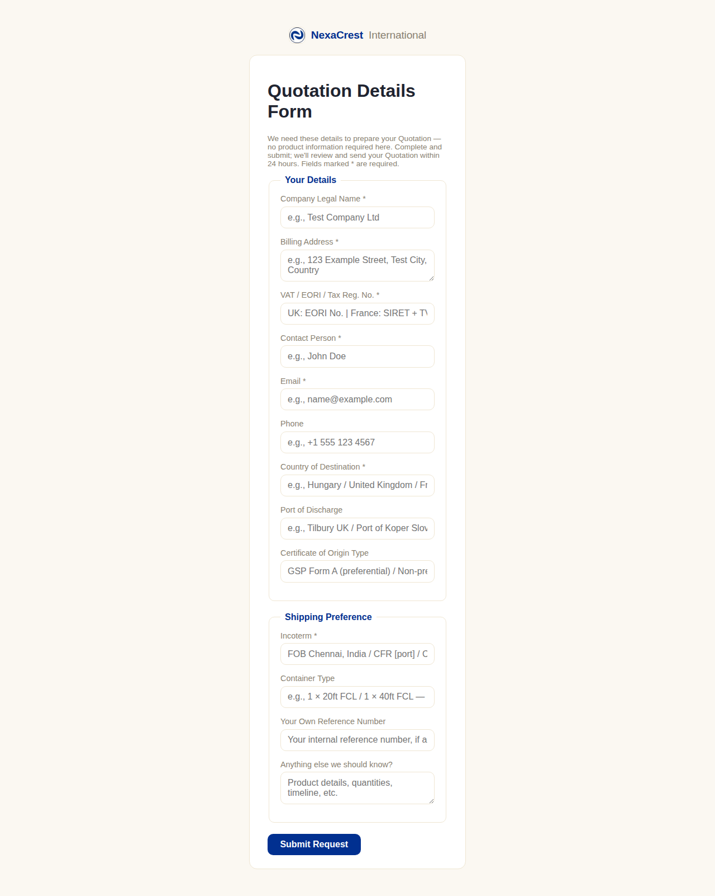
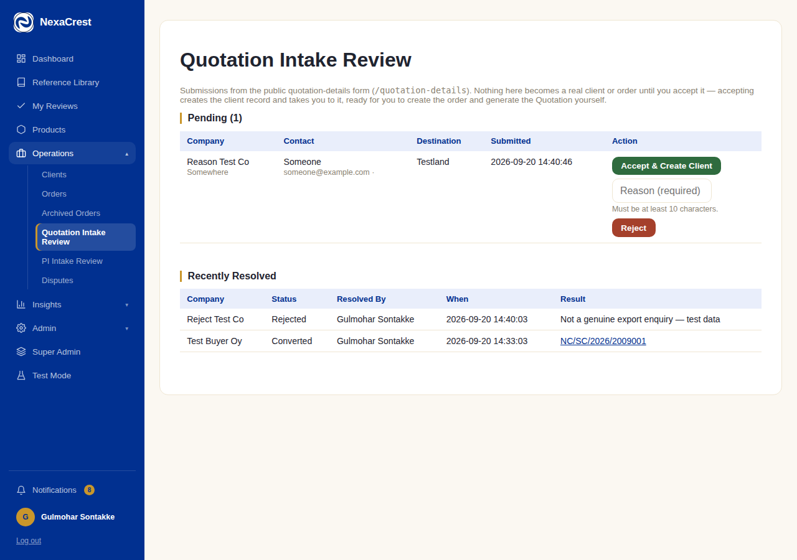
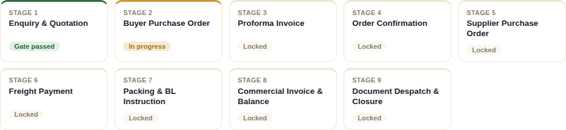
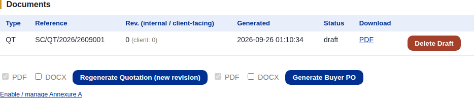

# Stage 1 — Enquiry & Quotation

## What this stage is for

Turning a buyer's interest into a real client record and a first Quotation
(QT) document. This is the only stage where the order doesn't exist yet —
everything before this point is either a public web form or a staff-entered
client record.

## The system does this automatically

- Nothing yet — Stage 1 is the one stage that always starts with a human
  action (either the buyer submitting the public form, or staff creating
  the client directly). There's no order to auto-progress until one exists.
- Once the Quotation is generated, the system immediately marks Stage 1 as
  **gate passed** and unlocks Stage 2 — this happens the moment the PDF is
  generated, not after anyone reviews or sends it (see the "one rule that
  applies to every stage" note in the [introduction](./00-introduction.md)).
- The system auto-generates the **Buyer Inquiry Ref** (e.g.
  `NC/SC/2026/2009001`) the moment a client record is created — staff never
  type this themselves.

## What staff do

An order can start from either of two paths:

### Path A — buyer submits the public form themselves

The buyer fills in `/quotation-details` — a public page, no login needed
(shareable link, e.g. sent from a Zoho lead). It only asks for company/
shipping details, deliberately **not** product details (those come later,
at the PI stage):

That submission lands in **Operations → Quotation Intake Review**
(`/client-intake`) as a pending row. Staff review it here and either:

- **Accept & Create Client** (with a reason, min. 10 characters) — creates
  the real client record and takes you straight to it, ready to create the
  order.
- **Reject** (with a reason) — if it's not a genuine enquiry.

Accepting **only creates the client** — it does not create an order or a
Quotation automatically. Staff still do that next, exactly as in Path B.

### Path B — staff create the client and order directly

For a walk-in enquiry that didn't come through the public form: **Clients →
Add Client** (`/clients/create`), fill in the same details by hand, save.
Then from that client's page, **Add Order** to create the order shell
(buyer inquiry ref, incoterm, payment preset, etc.).

### Both paths converge here — generating the Quotation

From the order page, under **Documents**, click **Generate Quotation**.
This is the one action that passes Stage 1's gate. The order's stage
tracker updates immediately:

The new QT document appears in the Documents table as a **draft** — it
still needs to go through [review and approval](./13-document-review-approval.md)
before it's the final, sendable version. A draft can be deleted (**Delete
Draft**) if it was generated by mistake — see that same chapter for when
that's appropriate.

Once the Quotation is approved, send it to the buyer from the order page
(**Send Document**) or compose a one-off email — see
[Document Review & Approval](./13-document-review-approval.md) for the full
send workflow.

## What the client does (or doesn't)

- **If they came through Path A**, they filled the public form — that's
  their only action at this stage. They are not notified of acceptance or
  rejection automatically; staff communicate the Quotation itself once it's
  ready (there's no client-portal login yet at this point — that only
  exists from Stage 3 onward, once the client's own portal account is
  provisioned).
- **If they came through Path B**, they've done nothing in the system yet
  — the whole stage is staff-only until the Quotation reaches them (by
  email, outside the system, or via the Send Document flow once built out).
- Either way, the client cannot see or act on anything inside this system
  at Stage 1 — there's no client-portal screen for the Quotation stage, and
  no portal login exists for them yet at all. Their portal account is only
  created automatically once the advance payment clears (Stage 3 → 4) —
  see [Chapter 3](./03-stage3-pi-advance.md).

## What happens next

Stage 2 (Buyer Purchase Order) is unlocked the instant the Quotation is
generated. See [Chapter 2](./02-stage2-buyer-po.md).
