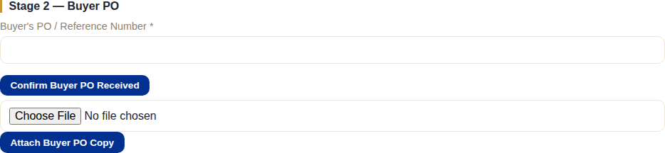
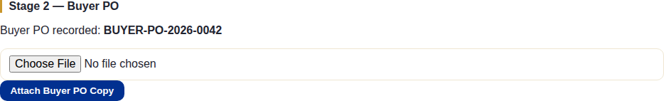
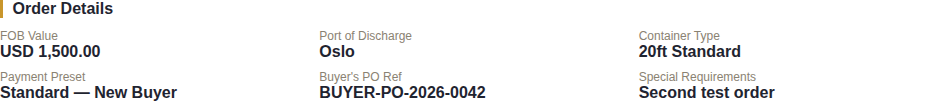
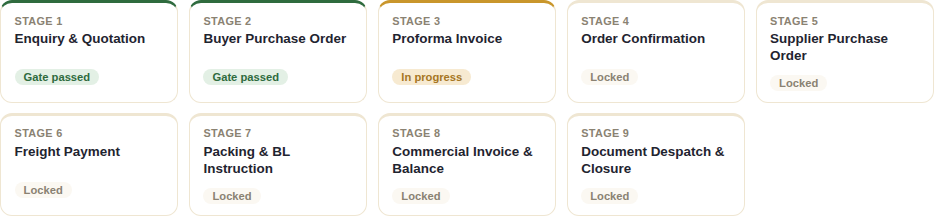

# Stage 2 — Buyer Purchase Order

## What this stage is for

Getting the buyer's own Purchase Order — their formal commitment to the
order — on file before staff issue the Proforma Invoice.

## The system does this automatically

- Nothing until staff act. There's no client-portal step here at all (the
  buyer doesn't yet have portal access — see Stage 3).

## What staff do

There are **two separate, independent actions** in this stage — don't
confuse one for the other:

1. **Generate Buyer PO** (up in the Documents section) — produces the
   BUYERPO PDF: NexaCrest's own purchase-order-style document, pre-filled
   with everything from the Quotation, with a blank "Buyer Acceptance"
   section at the end for the buyer to sign and return. This is the
   document that gets sent out — generating it does **not** pass the gate.

2. **Confirm Buyer PO Received** — the field staff actually type the
   buyer's own PO reference number into once it's back. **This is the
   action that passes Stage 2's gate.** It's a plain text field, required,
   with no connection to the file upload below it.

Separately, **Attach Buyer PO Copy** lets staff keep a scanned/uploaded
copy of the buyer's actual signed PO on file — version history, every
upload kept, nothing overwritten. This is purely for record-keeping and
**does not set the reference number or pass the gate on its own.**

> **Common confusion this causes:** if staff attach the buyer's PO copy but
> never separately type the reference number into "Confirm Buyer PO
> Received," the order's **Buyer's PO Ref** in Order Details will still
> read a plain "NIL" — even though a file is clearly on record. The system
> now shows *"Not yet recorded — N file(s) attached"* instead of a bare NIL
> in that situation, precisely so this half-done state is visible rather
> than looking like nothing happened at all.

Once confirmed, the order updates immediately:

## What the client does (or doesn't)

The buyer's role here happens **entirely outside the system**: they receive
the Buyer PO document (however staff send it), sign the "Buyer Acceptance"
section by hand, and return it. There's no client-portal screen for this —
they have no portal login yet at all at this point. Getting their signed PO
back to staff (email, courier, whatever channel) is on them, but nothing in
the system tracks or reminds them to do it.

## What happens next

Stage 3 (Proforma Invoice) unlocks the moment "Confirm Buyer PO Received"
is submitted. See [Chapter 3](./03-stage3-pi-advance.md).
