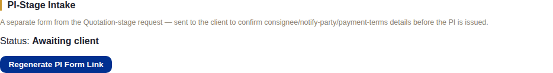
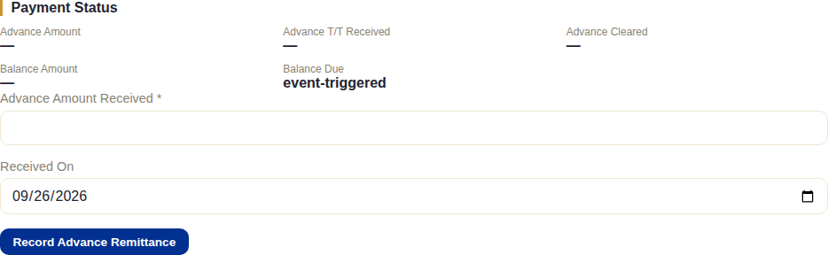
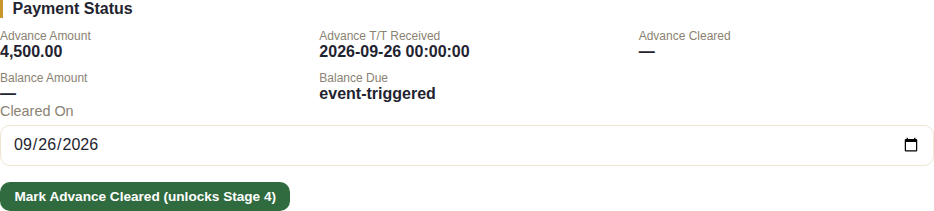
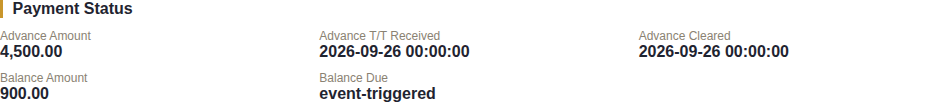
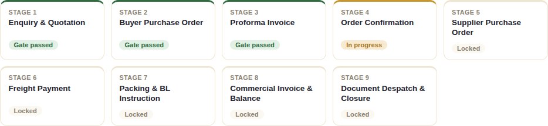

# Stage 3 — Proforma Invoice / Advance Payment

## What this stage is for

Locking down the exact shipment details the buyer will be invoiced on (who
receives the goods, which port, which Incoterm, how payment will actually be
split) and then generating the PI itself, whose real purpose is to trigger and
collect the advance payment before production or procurement begins.

## The system does this automatically

- **Nothing progresses this stage on its own.** The one thing the system
  does automatically is the client-portal login: the moment staff mark the
  advance payment cleared, a client login is created behind the scenes —
  the buyer never had to ask for one and staff never had to create one by
  hand. See "What happens next" below.
- The Balance Due date shown in Payment Status reads **"event-triggered"**
  rather than a fixed date — the balance isn't due on a calendar date, it's
  due when a later event (typically BL issuance, per the order's own
  payment terms) happens. The system doesn't try to guess that date ahead
  of time.

## What staff do

### First, optionally: the PI-stage intake form

This is a **second, separate confirmation step** from the Quotation-stage
intake in Chapter 1 — different form, different purpose, different review
queue. Once the Quotation is out, staff can generate a one-time link
(**Regenerate PI Form Link**, on the order page) and send it to the buyer to
confirm the exact details that will appear on the PI and later shipping
documents — consignee name and address, notify party, port of discharge,
confirmed Incoterm, container type, payment-terms confirmation, and Country
of Origin type — fields the Quotation stage never asked for.

This step is **entirely optional and never blocks anything** — staff can
generate the PI without it ever being sent or completed. When a submission
does come back, it lands in **Operations → PI Intake Review**
(`/pi-intake-review`), separate from the Quotation-stage queue, where staff
either:

- **Accept** — this is the authoritative correction point for the client's
  identity fields: accepting **overwrites the live client record** with
  exactly what the buyer confirmed (the PI Form spec requires these fields
  to match official documents exactly), locks the client's data from further
  edits, and — if the buyer supplied one — records the Buyer's PO Ref on the
  order. Everything else on the submission (payment-terms confirmation,
  confirmed Incoterm/port/COO, quotation-acceptance reference, any changes
  from the quotation) stays visible on the order for staff to read before
  generating the PI, but is never auto-written into the order's own
  structured fields.
- **Reject** (with a reason) — the buyer can resubmit via the same link.

### Generating the PI

From the order page, under **Documents**, **Generate Proforma Invoice**.
Unlike the Quotation, generating the PI **does not pass Stage 3's gate** —
this is the one stage where the gating action is a payment event, not a
document.

### Recording and clearing the advance payment

Before anything is recorded, Payment Status shows everything blank:

This is two separate steps, deliberately kept apart so a wire transfer that's
been sent but not yet reconciled against the bank statement isn't confused
with money that's actually landed:

1. **Record Advance Remittance** — staff type the amount received and the
   date, once the buyer's T/T notification comes in. This does **not** pass
   the gate yet:

   

2. **Mark Advance Cleared (unlocks Stage 4)** — staff confirm only once the
   funds have actually been verified against the bank statement. A
   confirmation dialog spells out exactly what this does before it happens:
   *"Mark the advance payment cleared? This unlocks Stage 4 and
   auto-provisions the client portal login — confirm the funds have
   actually landed first."* **This is the action that passes Stage 3's
   gate.**

   

If the buyer has self-reported a payment through their own portal (see
[Client Portal](./12-client-portal.md)), it appears further down this same
section under **Client-Reported Payments** — purely informational, and the
page explicitly warns staff to always verify against the actual bank
statement before recording anything above, never to record a payment based
on the client's self-report alone.

## What the client does (or doesn't)

- **PI-stage intake form**, if staff sent it: the buyer fills in consignee/
  notify-party/shipping/payment-term-confirmation details on a public,
  no-login page (`/pi-details/{token}`) and must tick a confirmation box
  stating the details are correct before submitting — this is the same
  consent that permanently locks their data once staff accept it.
- **The advance payment itself** happens entirely outside the system — the
  buyer wires the funds by whatever channel their bank uses. Nothing in the
  system notifies them to pay or tracks whether they have; staff learn about
  it only from the actual bank statement or T/T notification.
- **Self-reporting a payment** (optional, portal-only): once their portal
  login exists, the buyer *could* submit a payment report themselves — but
  at this exact point in Stage 3 they don't have a portal login yet, since
  it's only created once the advance is cleared. In practice, the very
  first payment a buyer could self-report through the portal is a later
  one (e.g. the balance payment at Stage 8), not this one.

## What happens next

The moment staff mark the advance payment cleared:

- **Stage 4 (Order Confirmation)** unlocks — see [Chapter 4](./04-stage4-order-confirmation.md).
- **The client portal login is created automatically**, behind the scenes,
  for this order's client — nobody has to remember to do this by hand. This
  is the earliest point in the pipeline the buyer can log in and see
  anything in the system themselves; everything before this stage (the
  public intake forms) required no login at all.
