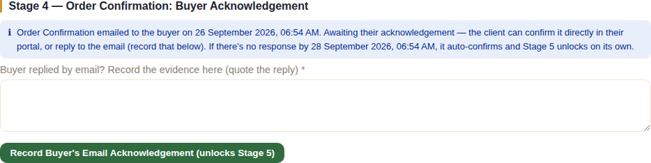
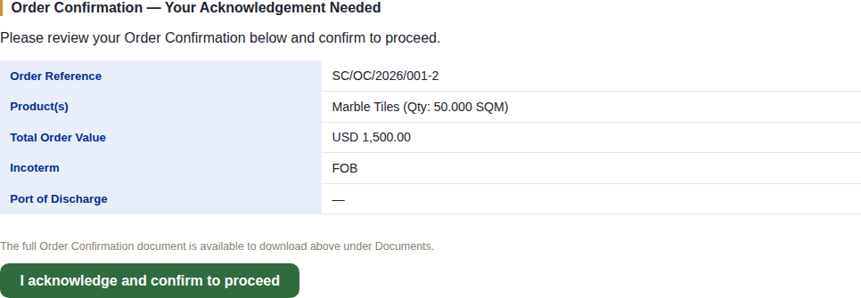
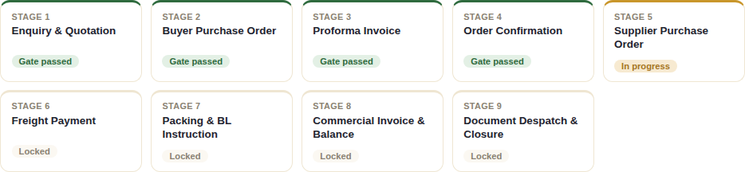

# Stage 4 — Order Confirmation

## What this stage is for

Getting the buyer to formally acknowledge the Order Confirmation (OC) —
NexaCrest's own document restating the full order terms — before production
or procurement begins on the supplier side. Unlike Stage 2's Buyer PO (which
the buyer signs and returns), this one is designed to resolve on its own
even if the buyer never responds at all.

## The system does this automatically

- The 48-hour acknowledgment clock starts the moment the OC is actually
  **emailed** to the buyer (not when it's generated, and not when it's
  merely approved internally) — see
  [Document Review & Approval](./13-document-review-approval.md) for the
  full draft → review → approved → sent path every document goes through
  first.
- If the buyer neither acknowledges in their portal nor replies by email
  within that 48-hour window, a scheduled routine **auto-confirms** the OC
  on their behalf and passes Stage 4's gate automatically — the order is
  never permanently stuck waiting on a buyer who simply doesn't respond.

## What staff do

Generate the Order Confirmation from the order page under **Documents**
(**Generate Order Confirmation**), same as any other document, then take it
through the normal review/approval/send cycle before it reaches the buyer —
see [Document Review & Approval](./13-document-review-approval.md) for that
full workflow. Generating or even approving the OC does **not** pass Stage
4's gate by itself; only the acknowledgment (by whichever of the three paths
below) does.

Once the OC has actually been emailed, the order page shows exactly where
things stand and offers the one thing staff can still do here — record an
acknowledgment that arrived by a channel other than the portal:

If the buyer replies to the email itself rather than using their portal
(common in practice), staff use **Record Buyer's Email Acknowledgement** —
this requires typing in the evidence (quoting the buyer's reply is normal
practice) before it's accepted; there's no way to record this without some
note attached. Once submitted, this **passes Stage 4's gate** directly.

Once resolved by any of the three paths, the section simply shows how and
when:

## What the client does (or doesn't)

This is the first stage where the buyer has real work to do **inside the
system itself** — their portal account exists from Stage 3 onward, and this
is its first real action. Logging in, they see a dedicated banner asking for
exactly one thing:

Clicking **I acknowledge and confirm to proceed** is the buyer's entire
role at this stage — a single button, deliberately with **no decline or
dispute option** presented here. This isn't the moment to raise a
disagreement; a genuine dispute has its own separate channel further along
(see [Disputes](./11-disputes.md), where enabled for that order) once
there's something concrete to dispute. Clicking it **passes Stage 4's gate**
immediately.

If the buyer does nothing at all — doesn't log in, doesn't reply to the
email — nothing further is expected of them either: the 48-hour auto-confirm
takes over on its own.

## What happens next

Whichever of the three paths resolves it (buyer clicks acknowledge in the
portal, staff record an email reply, or the 48-hour auto-confirm), the
result is identical — Stage 5 unlocks:

See [Chapter 5](./05-stage5-supplier-po.md) for Supplier Purchase Order.
