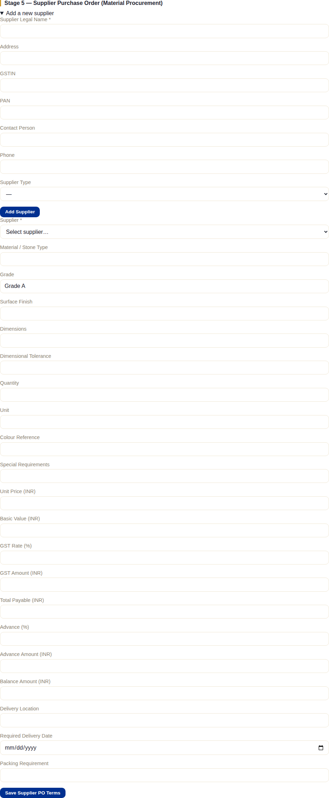
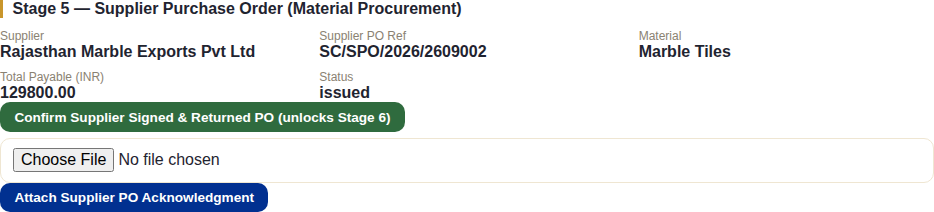
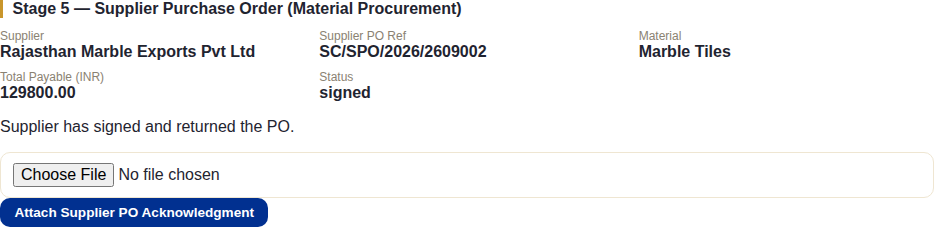
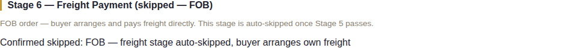
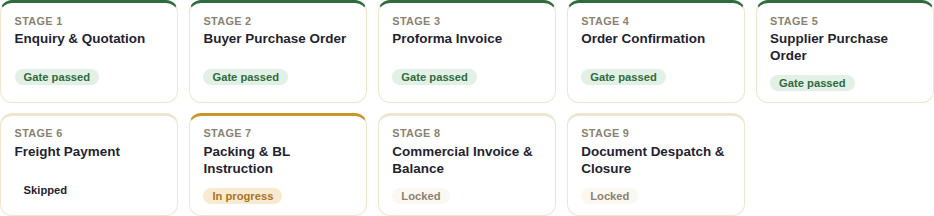

# Stage 5 — Supplier Purchase Order (Material Procurement)

## What this stage is for

Placing the actual procurement order with the supplier who will produce or
supply the material — a completely separate document and workflow from
anything the buyer sees, since the buyer never sees the Supplier PO or
knows who the supplier is.

## The system does this automatically

- Nothing progresses on its own — every action here is staff-entered, since
  this is an internal procurement step with no client involvement at all.
- **The FOB auto-skip**: the moment Stage 5's gate passes, the system checks
  the order's Incoterm. If it's **FOB**, Stage 6 (Freight Payment) is
  automatically marked **skipped** and Stage 7 unlocks immediately in its
  place — since on an FOB order the buyer arranges and pays for freight
  themselves, there's nothing for NexaCrest to collect at that stage. On a
  **CFR/CIF** order, Stage 6 unlocks normally instead. See
  [Chapter 6](./06-stage6-freight.md).

## What staff do

Stage 5 unlocks the moment Stage 4's gate passes. If no supplier exists yet
for this material, add one first, then fill in the Supplier PO's material
specification and commercial terms in the same section:

**Save Supplier PO Terms** creates the internal procurement record (and
generates the Supplier PO reference) — it does **not** generate the document
or pass any gate by itself. From **Documents**, **Generate Supplier PO**
produces the actual PDF, pre-filled with everything just entered, with a
blank acceptance section for the supplier to sign. Once terms are saved, the
section shows what's on file and offers the one action that matters here:

Exactly like Stage 2's Buyer PO, this is **two separate, independent
actions**:

1. **Confirm Supplier Signed & Returned PO** — the button staff click once
   the supplier's countersigned PO copy actually comes back. **This is the
   action that passes Stage 5's gate** (and triggers the FOB auto-skip
   check above).
2. **Attach Supplier PO Acknowledgment** — a separate file upload for
   keeping the supplier's actual signed copy on record, with version
   history. Like the Buyer PO's attachment, this is purely for
   record-keeping and **does not by itself confirm the signature or pass
   the gate**.

Once confirmed:

## What the client does (or doesn't)

**Nothing at all, and they're never shown anything about it.** The Supplier
PO, the supplier's identity, and the procurement terms are entirely internal
to NexaCrest — nothing here reaches the client portal, and no client-facing
document at any stage references this transaction. This is the one stage
in the whole pipeline with zero client involvement in either direction.

## What happens next

Confirming the supplier's signature passes Stage 5's gate — and, since this
running example order is on **FOB** terms, that same action immediately
auto-skips Stage 6:

On a CFR/CIF order, Stage 6 (Freight Payment) unlocks normally instead of
being skipped — see [Chapter 6](./06-stage6-freight.md) for that path.
Either way, [Chapter 7](./07-stage7-packing-bl.md) (Packing & BL
Instruction) is where both paths meet again.
