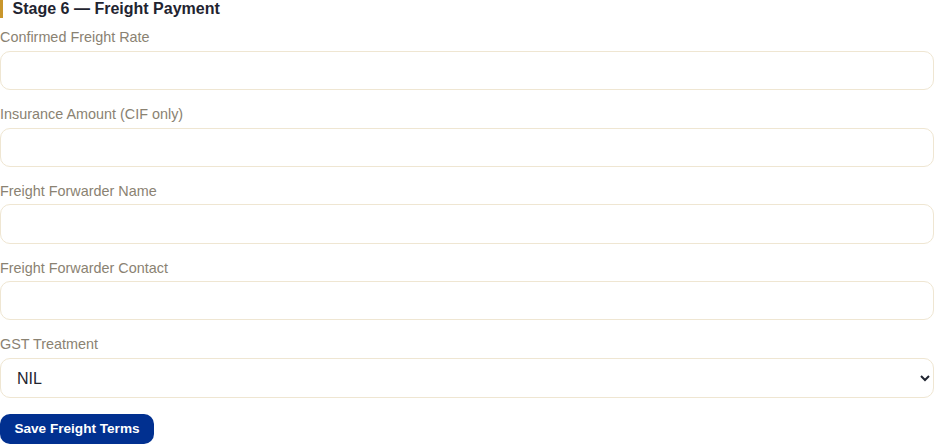
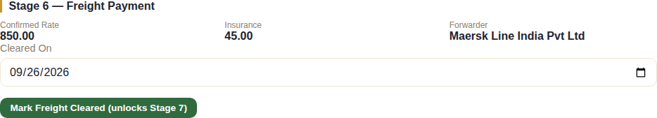
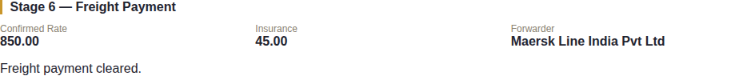
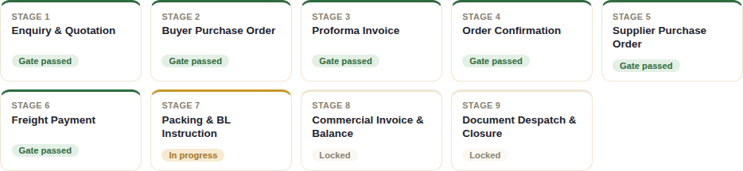

# Stage 6 — Freight Payment

## What this stage is for

Collecting the freight and insurance charges from the buyer on **CFR and
CIF orders only** — where NexaCrest arranges and pays the shipping line,
then recovers that cost from the buyer via a separate Freight Debit Note
(FDN). On an FOB order this whole stage is irrelevant, since the buyer
books and pays for their own freight directly.

> This chapter uses a **second example order** (a CIF order to a Norwegian
> buyer) rather than the main running example — SC/OC/2026/001-2 is on FOB
> terms, so Stage 6 auto-skips for it entirely (see the end of
> [Chapter 5](./05-stage5-supplier-po.md)). Everything else about this
> second order's journey through Stages 1–5 is identical to what the
> earlier chapters already covered.

## The system does this automatically

- **The FOB/CFR/CIF branch is decided automatically**, the instant Stage
  5's gate passes — staff never choose whether to skip this stage; the
  order's own Incoterm decides it. See [Chapter 5](./05-stage5-supplier-po.md)
  for the FOB skip path.
- Nothing else progresses without a staff action — there's no client
  involvement at this stage in either direction.

## What staff do

On a CFR/CIF order, Stage 6 unlocks as a normal stage once Stage 5 passes:

**Save Freight Terms** records the rate NexaCrest actually agreed with the
shipping line/forwarder (confirmed freight rate, insurance amount on CIF
orders, forwarder details, GST treatment) — this is internal record-keeping
only and doesn't pass any gate. From **Documents**, **Generate Freight Debit
Note** then produces the FDN — the actual invoice sent to the buyer for
these charges.

Recording and clearing the payment itself follows the exact same
two-step pattern as the advance payment in Stage 3:

1. **Record Freight Remittance** — the amount and date once the buyer's
   payment notification comes in. Does not pass the gate yet:

   

2. **Mark Freight Cleared (unlocks Stage 7)** — only once the funds are
   verified against the actual bank statement, same caution as every other
   payment-clearing action in this system. **This is the action that passes
   Stage 6's gate.**

   

## What the client does (or doesn't)

Nothing inside the system. The buyer pays the freight charge by wire
transfer against the FDN, entirely outside the system, the same as every
other payment in this pipeline — staff verify it against the bank statement
and record it themselves. There is no client-portal screen specific to
freight.

## What happens next

Clearing the freight payment passes Stage 6's gate and unlocks Stage 7:

This is the same place the FOB path from Chapter 5 also arrives at — from
here on, FOB and CFR/CIF orders follow an identical process. See
[Chapter 7](./07-stage7-packing-bl.md) for Packing & BL Instruction.
