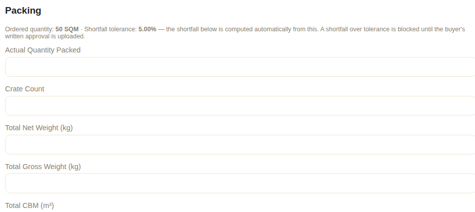
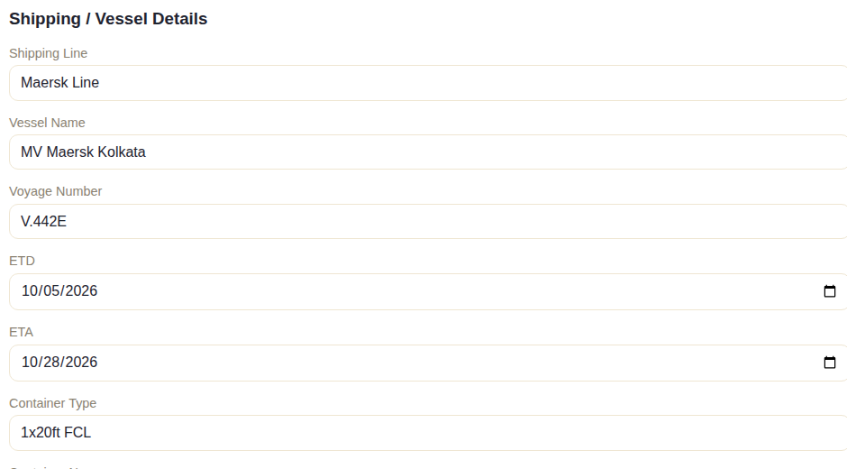
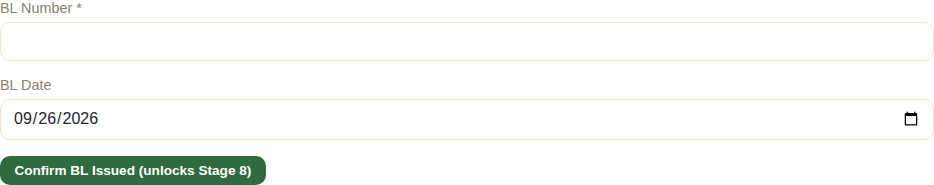
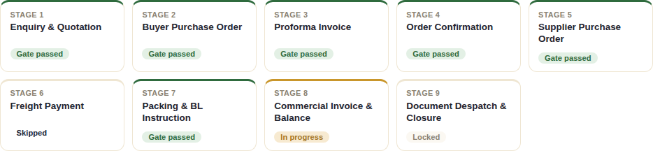

# Stage 7 — Packing & BL Instruction

## What this stage is for

Recording exactly what was physically packed and shipped (crate-by-crate),
capturing the vessel/shipping details, and confirming the Bill of Lading
(BL) once the vessel actually departs — the point at which the goods are
formally handed to the carrier.

This is the stage where **FOB and CFR/CIF orders converge again** — whichever
path an order took through Stage 5/6, they arrive here identically.

## The system does this automatically

- **The shortfall tolerance check runs automatically.** The moment staff
  open this section, the system already knows the ordered quantity (from
  the order's product lines) and the configured tolerance percentage, and
  computes the shortfall live as staff enter the actual quantity packed —
  staff never calculate this by hand:

  

- If the shortfall comes out **within tolerance**, nothing further is
  required. If it's **over tolerance**, the system blocks proceeding until
  the buyer's written approval of that shortfall is uploaded as evidence —
  this is a hard rule, not a warning.

## What staff do

Three things happen in this section, each building toward the BL:

1. **Save Packing & Crates** — actual quantity packed, crate count, weights,
   CBM, packing date, and a crate-by-crate breakdown (marks & numbers,
   dimensions, pieces, weight, HS code per crate). Once saved, **Generate
   Packing List** produces the PL document.
2. **Save Shipping Details** — shipping line, vessel name, voyage number,
   ETD/ETA, container and seal numbers:

   

   Once saved, **Generate BL Instruction Sheet** produces the instruction
   document sent to the shipping line/forwarder telling them exactly how to
   issue the Bill of Lading.
3. **Confirm BL Issued** — once the shipping line actually issues the BL,
   staff type its number in here. **This is the action that passes Stage
   7's gate.**

   

Once confirmed:

## What the client does (or doesn't)

Nothing at this stage — packing, vessel booking, and BL issuance are all
internal/carrier-side activities with no client-portal screen or action
involved. The buyer finds out what shipped and how only once the relevant
documents (Packing List, and later the scanned BL copy in Stage 8) are sent
to them.

## What happens next

Confirming the BL number passes Stage 7's gate and unlocks Stage 8:

See [Chapter 8](./08-stage8-ci-balance.md) for Commercial Invoice & Balance
Payment.
