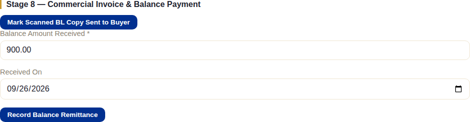
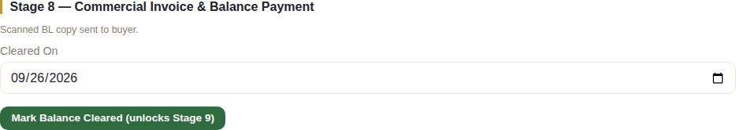
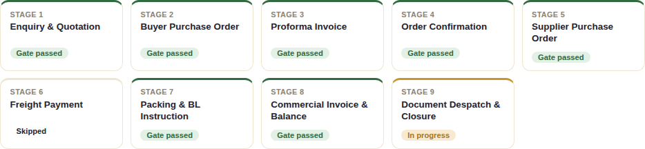

# Stage 8 — Commercial Invoice & Balance Payment

## What this stage is for

Issuing the Commercial Invoice (CI) — the final, legally definitive invoice
for the shipment, replacing the Proforma Invoice — and collecting the
remaining balance payment before the final closure stage.

## The system does this automatically

- The balance amount is already known from the payment preset applied back
  at order creation, so the **Balance Amount Received** field arrives
  pre-filled with the expected figure — staff aren't calculating it by hand,
  though they can still adjust it if what actually landed differs.
- Nothing else progresses without a staff action.

## What staff do

This section bundles two independent things — sending the buyer proof of
shipment, and collecting final payment:

**Mark Scanned BL Copy Sent to Buyer** is a simple confirmation that the
buyer has been sent a copy of the Bill of Lading now that it's been
issued — purely a record-keeping checkbox, it doesn't affect the gate.

From **Documents**, **Generate Commercial Invoice** produces the CI —
pre-filled with the actual shipped quantities and final figures rather than
the estimates the PI was built on.

Recording and clearing the balance payment follows the same two-step
pattern as every other payment in this pipeline:

1. **Record Balance Remittance** — amount and date once the buyer's payment
   notification arrives.

   

2. **Mark Balance Cleared (unlocks Stage 9)** — the confirmation dialog here
   carries an extra warning beyond the usual "confirm the funds have
   landed": *"...and that the BL hasn't been released early if this is a
   post-BL preset"* — a reminder that some payment presets are specifically
   structured so the balance is due against the BL, and releasing the BL to
   the buyer before that payment clears would undermine the whole point of
   that preset. **This is the action that passes Stage 8's gate.**

   

## What the client does (or doesn't)

Nothing inside the system. The buyer receives the scanned BL copy and the
Commercial Invoice through whatever channel staff use to send documents,
and wires the balance payment outside the system — staff verify it against
the bank statement and record it themselves, exactly as with every other
payment stage.

## What happens next

Clearing the balance payment passes Stage 8's gate and unlocks the final
stage:

See [Chapter 9](./09-stage9-despatch-closure.md) for Document Despatch &
Closure — the final stage.
