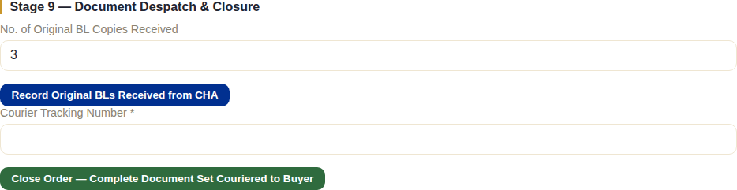
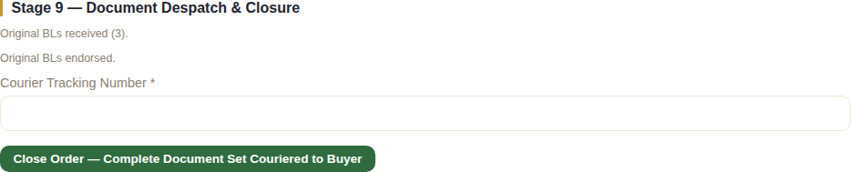
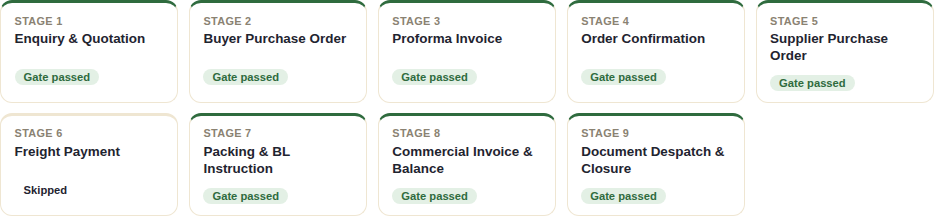

# Stage 9 — Document Despatch & Closure

## What this stage is for

Wrapping up the paperwork side of a completed shipment — getting the
original Bill of Lading copies back from the clearing agent, endorsing them,
and courying the complete final document set to the buyer — then formally
closing the order.

## The system does this automatically

- Nothing progresses without a staff action; this stage is purely
  administrative wrap-up.
- Closing the order also marks it **complete** in the system's own records
  (distinct from *archived*, which only affects visibility — see
  [Admin & Settings](./15-admin-settings.md)).

## What staff do

Stage 9 unlocks the moment the balance payment clears in Stage 8:

Two optional record-keeping steps, then the closing action:

1. **Record Original BLs Received from CHA** — how many original Bill of
   Lading copies came back from the Customs House Agent.
2. **Mark Original BLs Endorsed by NexaCrest** — confirms NexaCrest has
   endorsed them (signed over) ready to hand to the buyer.

> **Neither of these two steps is actually required to close the order** —
> notice in the screenshot above that **Close Order** was available from the
> very start of this stage, before either box was ticked. They exist to keep
> a record of the physical document handling, but the system trusts staff to
> follow the real-world process in the right order rather than enforcing it
> as a hard rule here.

**Close Order — Complete Document Set Couriered to Buyer** is the final
action in the entire pipeline: staff enter the courier tracking number for
the package containing the buyer's originals (final CI, endorsed BL,
Certificate of Origin, etc.) and submit. **This is the action that passes
Stage 9's gate and marks the order complete.**

## What the client does (or doesn't)

Nothing inside the system. The buyer receives the physical courier package
and, separately, whatever digital copies staff have already sent by email
at earlier stages. There's no client-portal acknowledgment step for
receiving the final document set — the courier tracking number is the
system's own record that despatch happened.

## What happens next

Nothing — this is the end of the pipeline. The order's stage tracker shows
all nine stages resolved (eight "Gate passed," one "Skipped" for this FOB
example's Stage 6):

From here, the order remains in the system as a completed record — visible
in [Reports](./14-reports.md), still reachable from the client's own order
history, but with no further actions expected of anyone.
