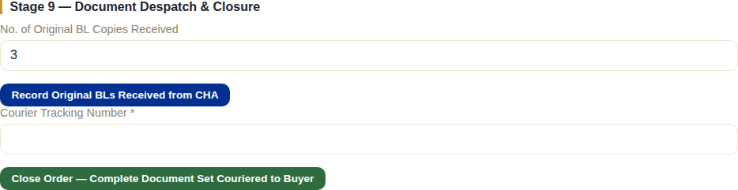
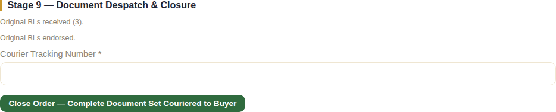
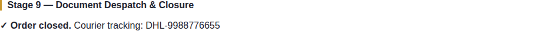
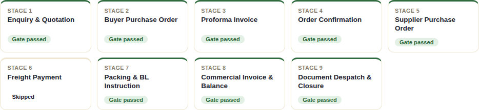

# Stage 9 — Document Despatch & Closure

## What this stage is for

Wrapping up the paperwork side of a completed shipment — getting the
original Bill of Lading copies back from the clearing agent, endorsing them,
and courying the complete final document set to the buyer — then formally
closing the order.

## The system does this automatically

- Nothing progresses without a staff action; this stage is purely
  administrative wrap-up.
- Closing the order also marks it **complete** in the system's own records
  (distinct from *archived*, which only affects visibility — see
  [Admin & Settings](./15-admin-settings.md)).

## What staff do

Stage 9 unlocks the moment the balance payment clears in Stage 8:

Two optional record-keeping steps, then the closing action:

1. **Record Original BLs Received from CHA** — how many original Bill of
   Lading copies came back from the Customs House Agent.
2. **Mark Original BLs Endorsed by NexaCrest** — confirms NexaCrest has
   endorsed them (signed over) ready to hand to the buyer.

> **Neither of these two steps is actually required to close the order** —
> notice in the screenshot above that **Close Order** was available from the
> very start of this stage, before either box was ticked. They exist to keep
> a record of the physical document handling, but the system trusts staff to
> follow the real-world process in the right order rather than enforcing it
> as a hard rule here.

**Close Order — Complete Document Set Couriered to Buyer** is the final
action in the entire pipeline: staff enter the courier tracking number for
the package containing the buyer's originals (final CI, endorsed BL,
Certificate of Origin, etc.) and submit. **This is the action that passes
Stage 9's gate and marks the order complete.**

## BL Endorsement document

Once **Record Original BLs Received from CHA** has been ticked, a **BL
Endorsement** panel appears on the order page (gated on the same
`manage_shipping` permission as the two record-keeping steps above). It
has two parts:

1. **A small CRUD form** capturing the handful of endorsement-specific
   details not already held anywhere else on the order: **BL Number**,
   **Vessel / Voyage**, **Port of Loading** (pre-filled `Chennai, India` if
   nothing else on the order suggests otherwise), **Port of Discharge**,
   and **Date of Endorsement**. Saving this form is independent of — and
   does not touch — the Freight-stage shipping record; it can be edited
   and re-saved as many times as needed before (or after) generating the
   document.
2. **Generate / Print BL Endorsement** — appears once the form above has
   been saved at least once. Produces a one-page PDF, in NexaCrest's
   letterhead, meant to be physically written onto the reverse of each
   original Bill of Lading: it restates the saved BL Number, Vessel /
   Voyage, Port of Loading, Port of Discharge, and Date of Endorsement,
   alongside the order's PI/CI reference numbers, the "Pay to the order
   of" consignee (resolved live from the order's current Consignee
   details — same-as-buyer or independent, whichever applies right now),
   and the authorised signatory block.

Unlike every other buyer-facing document in the system, the BL Endorsement
skips the normal draft → in-review → approved cycle entirely — generating
it immediately marks it **approved** and makes it visible to the buyer in
their client-portal document list. This is deliberate: by the time staff
reach this step they have already confirmed every value on the CRUD form
one step earlier, so a second-person review of a mechanical restatement of
those same values adds no real check. Each regeneration (editing the form
and generating again) bumps the document's revision number on the same
reference rather than starting a new one.

## Compliance Checklist

A separate "Compliance Checklist" panel sits on every order's own page
(visible regardless of which stage the order is currently in) tracking
pre-closure compliance tasks — ECGC Cover, Pre-Shipment Inspection,
Fumigation Certificate, Phytosanitary Certificate, Due Diligence by
default; Admin can add more from
[Compliance Task Types](./15-admin-settings.md). Each task's status is one
of **Not Started** (the default — no row exists yet until staff first
touch it), **Pending Approval**, **Approved**, or **Skipped (Not
Applicable)** — skipping requires a reason, since "not applicable to this
order" still needs to be recorded, not just silently left blank.

Visibility of the whole panel, and every status change on it, is gated on
the same `close_orders` permission that gates the **Close Order** button
above — "the person who has permission to close the order must able to see
this otherwise no meaning for this." There is no separate permission for
the checklist itself. Every status change is recorded in the order's own
[Audit Log](./13-document-review-approval.md) under
`COMPLIANCE_TASK_STATUS_UPDATED`.

The checklist does not itself gate **Close Order** — closing still only
requires Stage 9's own gate (BL originals/endorsement) and the courier
tracking number. The checklist is a tracking aid for the same person who
has the authority to close the order, not an additional hard-coded lock.

## What the client does (or doesn't)

Nothing inside the system. The buyer receives the physical courier package
and, separately, whatever digital copies staff have already sent by email
at earlier stages. There's no client-portal acknowledgment step for
receiving the final document set — the courier tracking number is the
system's own record that despatch happened.

## What happens next

Nothing — this is the end of the pipeline. The order's stage tracker shows
all nine stages resolved (eight "Gate passed," one "Skipped" for this FOB
example's Stage 6):

From here, the order remains in the system as a completed record — visible
in [Reports](./14-reports.md), still reachable from the client's own order
history, but with no further actions expected of anyone.
