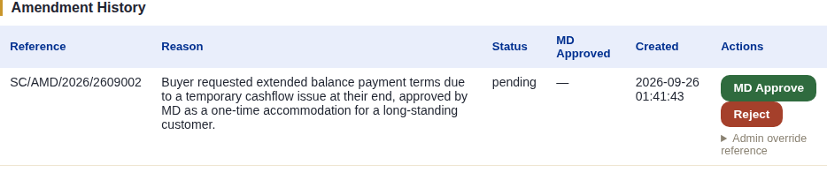
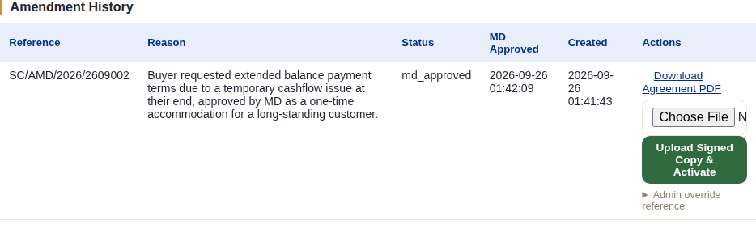
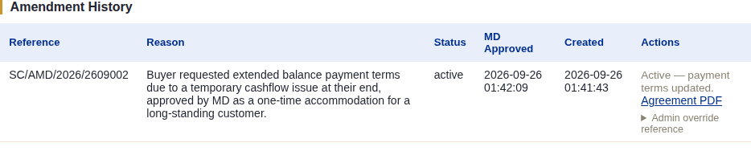

# Amendments

## What this module is for

Changing an order's **payment terms** — advance percentage, balance terms,
what triggers the balance (before shipment vs. against BL), balance days —
after the Proforma Invoice is already issued, in a way that's legally
binding on both parties rather than an informal email exchange. This exists
because payment terms are a hard commitment once the PI is out; changing
them needs its own paper trail, distinct from every other kind of order
edit.

Amendments can be raised on any order once a PI exists, regardless of what
stage it's currently at — this module isn't part of the 9-stage pipeline
and doesn't block or unlock any stage gate.

## The system does this automatically

- Generates the amendment reference (e.g. `SC/AMD/2026/2609002`) the moment
  a request is created.
- The moment a signed copy is uploaded, the system **activates the
  amendment and updates the order's live payment terms immediately** —
  staff don't separately go update the payment preset or terms anywhere
  else afterward.
- Every document generated for this order **after** the amendment goes
  active carries a visible note identifying which amendment is in effect
  and from when — so nobody downstream mistakes an old-terms document for
  current.

## What staff do

From **Amendments** on the order page, the full sequence is:

1. **Raise a New Amendment Request** — reason (required, min. 10
   characters), who requested it (importer or NexaCrest), and only the
   specific terms actually changing (advance %/amount, balance terms text,
   balance trigger, balance days, balance amount) — anything left blank
   stays unchanged. This is staff data entry only; it doesn't touch the
   order yet.

   

2. **MD Approve** — a Managing Director-level sign-off is required before
   any amendment document exists at all; **Reject** is available instead if
   it shouldn't proceed.
3. **Generate Agreement Document** — produces the actual Payment Terms
   Amendment Agreement PDF, with a blank importer signature/designation/date
   section exactly like the AMD document discussed for Stage 2's Buyer PO —
   these fields are never pre-filled or editable anywhere in the system;
   the importer's actual signature only ever exists on the physical/scanned
   returned copy.
4. **Upload Signed Copy & Activate** — once the importer's countersigned
   copy comes back, staff upload it here directly.

   

The moment that upload succeeds, the amendment is **active** and the
order's payment terms are already updated — there's no separate "apply"
step:

An **Admin override reference** option exists for correcting the amendment's
own reference number if needed (this internal reference is never printed on
any buyer-facing document, which is what makes it safe to allow editing at
all) — it requires a logged reason, same as every override in this system.

## What the client does (or doesn't)

Entirely offline. The importer receives the Agreement document (however
staff send it), signs and stamps it by hand, and returns the scanned copy —
there's no client-portal screen for amendments at all, and no way for the
buyer to request or view one from inside the system themselves. Getting the
signed copy back to staff is on the buyer, exactly like the Buyer PO and
Supplier PO wet-signature flows elsewhere in this system.

## What happens next

Nothing is unlocked or triggered in the 9-stage pipeline — the order simply
continues from wherever it already was, now under the amended terms. Any
document generated from this point on reflects the new terms and carries
the amendment reference note described above.
