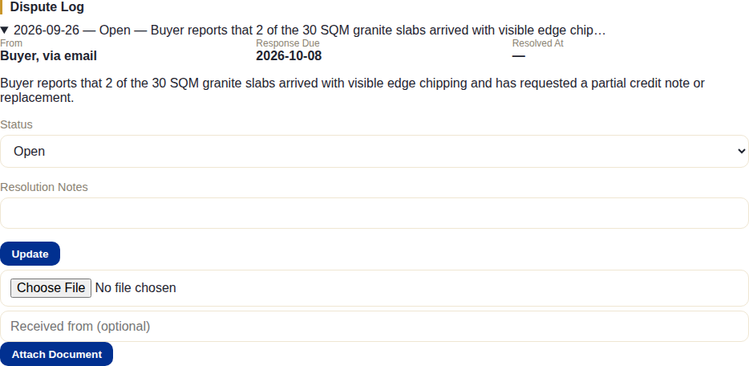
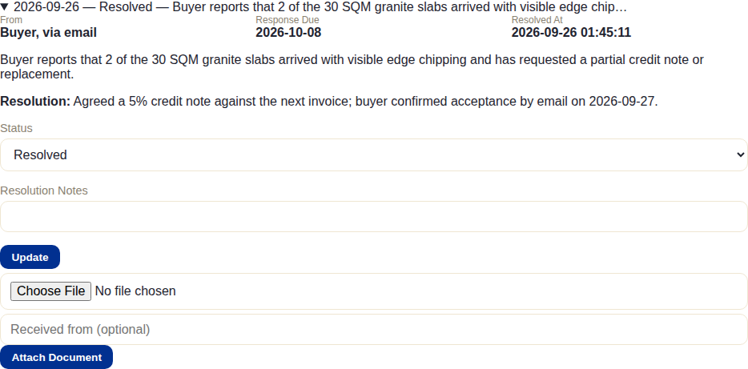
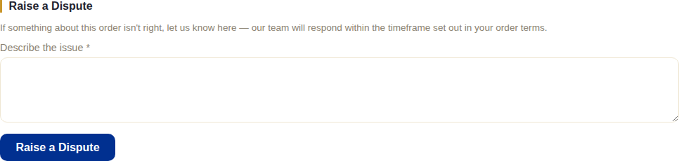

# Disputes

## What this module is for

Formally recording and tracking a disagreement with a buyer — quality
complaints, delivery issues, anything that needs a documented response
within a committed timeframe — separate from the routine order-progress
comments in [Client Portal](./12-client-portal.md).

Like Amendments, this isn't part of the 9-stage pipeline: a dispute can be
raised at any point on any order and never blocks or unlocks a stage gate.

## The system does this automatically

- **The response-due date is calculated automatically** the moment a
  dispute is logged — using **working days**, not calendar days, against
  the company's configured response window (10 working days by default).
  Weekends and holidays are correctly excluded rather than naively counted,
  so the promised response date matches what the Dispute Resolution clause
  on the order's own documents actually commits to.

## What staff do

From **Disputes** on the order page:

**Log Dispute** — notice date, who it's from (free text, e.g. "Buyer, via
email"), a mandatory description, and optionally assign it to a specific
staff member.

For each logged dispute, staff can then update its **Status** (with
resolution notes once resolved) and **Attach Document** — any evidence or
correspondence relevant to the dispute, with an optional "received from"
note:

Once resolved:

A dedicated **global Disputes log** (separate from any one order) lists
every dispute across all orders, filterable by status — useful for seeing
what's still open company-wide rather than checking order by order.

### Letting the client raise their own disputes

By default, the buyer has no way to raise a dispute themselves — there's no
button in their portal. Staff choose, **per order**, whether to expose one:
a checkbox on the order page, **"Show 'Raise a Dispute' button to the client
in their portal for this order,"** turns it on or off. This is deliberately
not a blanket setting — some orders/relationships may warrant it, others
not.

## What the client does (or doesn't)

**If the checkbox above is off** (the default): nothing — there's no
dispute-related screen or button anywhere in their portal for that order.

**If it's on**, the buyer sees a simple form:

They can only submit a description — no status, no resolution, no document
upload from their side. Once submitted, the same working-days response
clock starts, and it's staff who take it from there exactly as if they'd
logged it themselves.

## What happens next

Nothing is automatically unlocked or triggered elsewhere in the system.
Resolving a dispute is purely a record update — the order's own pipeline
progress is entirely unaffected by a dispute being open, in progress, or
resolved.
