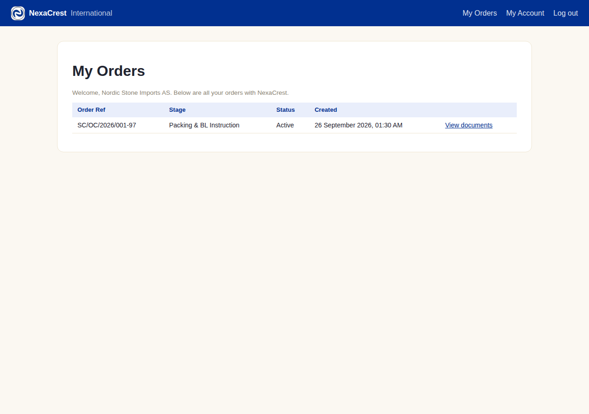
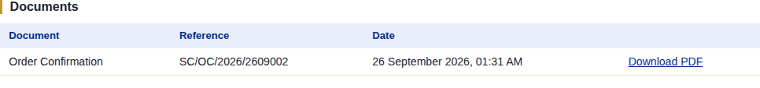
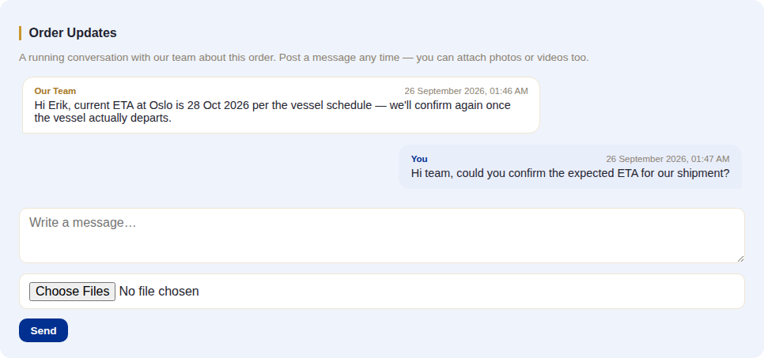
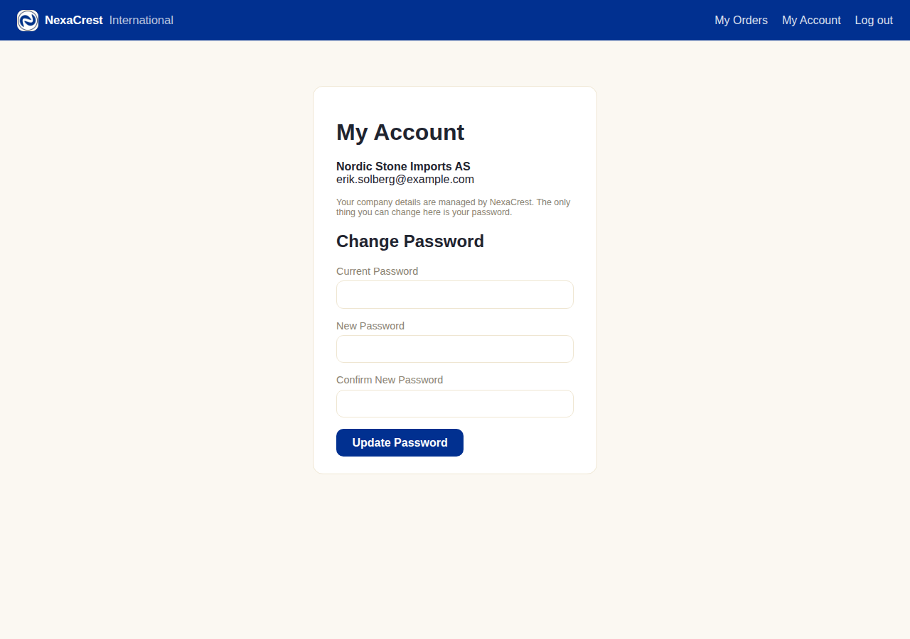

# Client Portal

## What this module is for

Everything the buyer can see and do themselves, gathered in one place. This
chapter is a reference to the portal as a whole — most of its individual
actions (acknowledging the OC, self-reporting a payment, raising a dispute)
already have their own detailed walkthrough earlier in this document; this
chapter shows how they fit together on the buyer's actual screens, plus the
two screens that don't belong to any single stage: the order list and the
account page.

## The system does this automatically

- **The portal login doesn't exist until Stage 3 → 4** (the advance payment
  clearing) — see [Chapter 3](./03-stage3-pi-advance.md). Before that point,
  the buyer has no way to log in at all, regardless of what they've done on
  public forms.
- The buyer only ever sees the **final, approved/sent** PDF of a
  customer-facing document — never a draft, never an internal-only file
  type, regardless of what's requested. This is enforced on every single
  document download, not just filtered from the list.

## What the client sees and does

### My Orders (the dashboard)

The landing page after login — every order this client has, its current
stage name, status, and a link into each:

### Inside an order

Opening an order (**View documents**) shows, top to bottom:

1. **Order Confirmation — Your Acknowledgement Needed** — only appears
   when there's a pending OC acknowledgment; see
   [Chapter 4](./04-stage4-order-confirmation.md) for the full mechanics.
2. **Documents** — every customer-facing document generated so far, each
   with a direct PDF download:

   

3. **Order Updates** — a running two-way chat thread with staff, separate
   from every stage-specific action. Either side can post a message and
   attach photos/videos/PDFs at any time; there's no approval step, it's
   simply a shared conversation log attached to the order:

   

4. **Report a Payment** — the buyer's own note that they've paid, covered
   in detail in [Chapter 3](./03-stage3-pi-advance.md) (Payment Status) —
   purely informational, staff still verify against the bank statement
   before recording anything themselves.
5. **Raise a Dispute** — only shown when staff have switched it on for this
   specific order; see [Disputes](./11-disputes.md).

### My Account

The only self-service screen outside a specific order — the buyer can
change their own password, nothing else. Company/contact details are staff-
managed and explicitly not editable here:

## What happens next

Nothing in the portal itself triggers pipeline progress except the two
specific actions already covered in their own chapters: acknowledging the
OC (passes Stage 4) and, indirectly, self-reported payments (which staff
still have to verify and record through the normal stage-payment actions
before anything actually clears).
