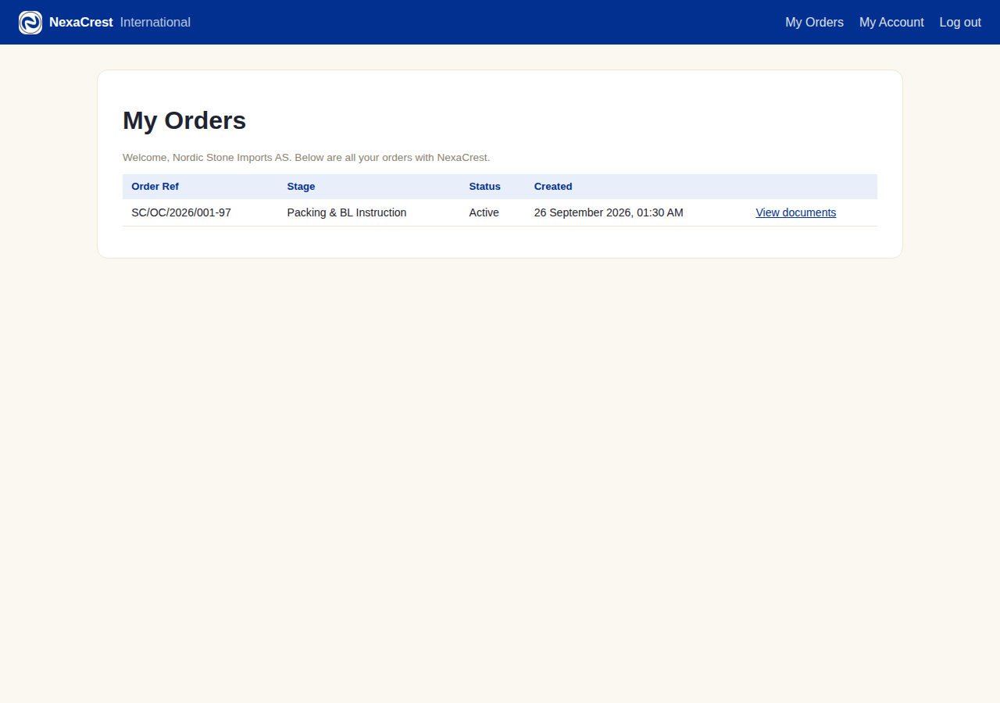
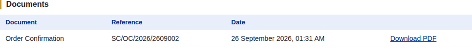
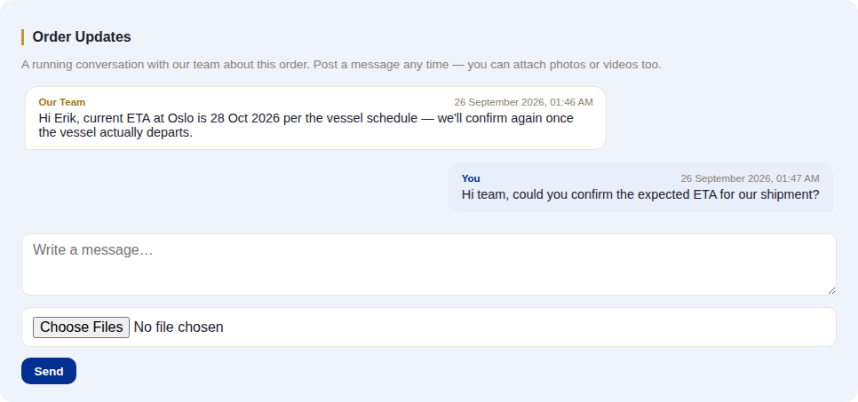
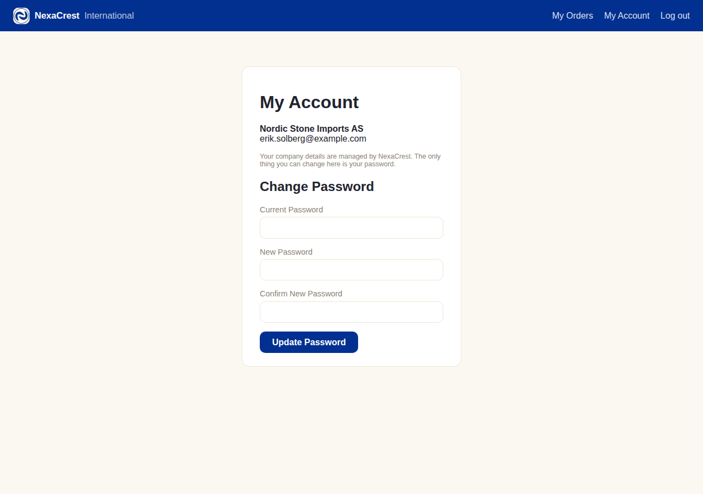

# Client Portal

## What this module is for

Everything the buyer can see and do themselves, gathered in one place. This
chapter is a reference to the portal as a whole — most of its individual
actions (acknowledging the OC, self-reporting a payment, raising a dispute)
already have their own detailed walkthrough earlier in this document; this
chapter shows how they fit together on the buyer's actual screens, plus the
two screens that don't belong to any single stage: the order list and the
account page.

## The system does this automatically

- **The portal login doesn't exist until Stage 3 → 4** (the advance payment
  clearing) — see [Chapter 3](./03-stage3-pi-advance.md). Before that point,
  the buyer has no way to log in at all, regardless of what they've done on
  public forms — except via staff impersonation, below.
- The buyer only ever sees the **final, approved/sent** PDF of a
  customer-facing document — never a draft, never an internal-only file
  type, regardless of what's requested. This is enforced on every single
  document download, not just filtered from the list.

## Staff access on behalf of a client ("Log in as this client")

Not every buyer can realistically use the portal themselves — a client
who created no email, a 70-year-old buyer with only a phone, or simply an
order that hasn't reached Stage 3 yet so no portal login exists at all.
For exactly this situation, staff can open a client-portal session on a
client's behalf from that client's own staff-side page, without needing
their password (there may not even be one yet) and without creating or
touching a `client_logins` row.

This is deliberately gated behind **three independent switches**, all of
which must be on before the "Log in as this client" button even appears:

1. **A permission** (`impersonate_client`) — who may use the feature at
   all. Granted to Admin/MD/ED/Super Admin by default, the same tier as
   other sensitive, wide-blast-radius actions (e.g. `manage_disputes`).
2. **A per-client toggle**, set on that client's own staff-side page
   ("Client Portal Access" section) — whether *this specific client* may
   ever be impersonated. Off by default for every client.
3. **A global kill switch** (Settings → `client_impersonation_enabled`) —
   off by default. With this off, the feature is unavailable for every
   client, no matter what permission a staff member holds or what any
   individual client's own toggle says.

All three hold → the button appears and works. Any one missing → it either
doesn't appear, or (if reached directly) is refused with a message naming
which gate is closed — the controller re-checks all three itself rather
than trusting the button's own visibility.

Once started, the portal shows an amber banner on every screen —
**"A staff member is viewing this portal on this client's behalf"** — with
an **End impersonation** button that returns to that client's own
staff-side page. The staff member's own login is untouched throughout:
starting or ending impersonation never logs them out of the staff app, and
the usual **ClientAuth** per-request checks are relaxed only for the
`client_logins`-row requirement (which may not exist yet) — the client
record itself must still be active, or the session is ended automatically
on the very next portal request.

Every start and end of an impersonated session is written to the audit
log (`CLIENT_IMPERSONATION_STARTED` / `CLIENT_IMPERSONATION_ENDED`), and
changing a client's own toggle is logged as
`CLIENT_IMPERSONATION_ALLOWED_CHANGED`. While impersonating, a staff member
can do anything the client themselves could do in the portal — download
documents, acknowledge the OC, upload the signed Buyer PO, self-report a
payment, raise a dispute, request a reorder — with one exception: changing
the client's own portal password still requires their current password,
so impersonation cannot be used to take over or lock out a real client
login.

## What the client sees and does

### My Orders (the dashboard)

The landing page after login — every order this client has, its current
stage name, status, and a link into each:

### Inside an order

Opening an order (**View documents**) shows, top to bottom:

1. **Order Confirmation — Your Acknowledgement Needed** — only appears
   when there's a pending OC acknowledgment; see
   [Chapter 4](./04-stage4-order-confirmation.md) for the full mechanics.
2. **Documents** — every customer-facing document generated so far, each
   with a direct PDF download:

   

3. **Buyer PO** — lets the client upload a scanned copy of their own signed
   Purchase Order at any time, once they've signed it, rather than relying
   solely on emailing it to staff. Every past upload is listed (file name +
   upload date); re-uploading a corrected copy never removes the earlier
   one — see [Chapter 2](./02-stage2-buyer-po.md) for how this feeds the
   same record the internal staff-side upload writes to.
4. **Order Updates** — a running two-way chat thread with staff, separate
   from every stage-specific action. Either side can post a message and
   attach photos/videos/PDFs at any time; there's no approval step, it's
   simply a shared conversation log attached to the order:

   

5. **Report a Payment** — the buyer's own note that they've paid, covered
   in detail in [Chapter 3](./03-stage3-pi-advance.md) (Payment Status) —
   purely informational, staff still verify against the bank statement
   before recording anything themselves.
6. **Raise a Dispute** — only shown when staff have switched it on for this
   specific order; see [Disputes](./11-disputes.md).

### My Account

The only self-service screen outside a specific order — the buyer can
change their own password, nothing else. Company/contact details are staff-
managed and explicitly not editable here:

## What happens next

Nothing in the portal itself triggers pipeline progress except the two
specific actions already covered in their own chapters: acknowledging the
OC (passes Stage 4) and, indirectly, self-reported payments (which staff
still have to verify and record through the normal stage-payment actions
before anything actually clears).
