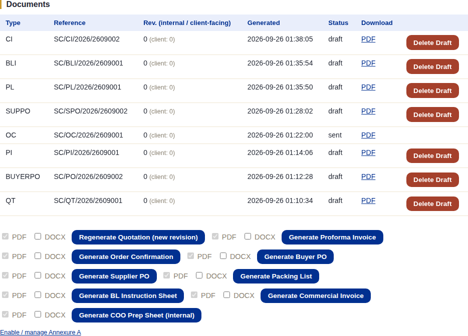
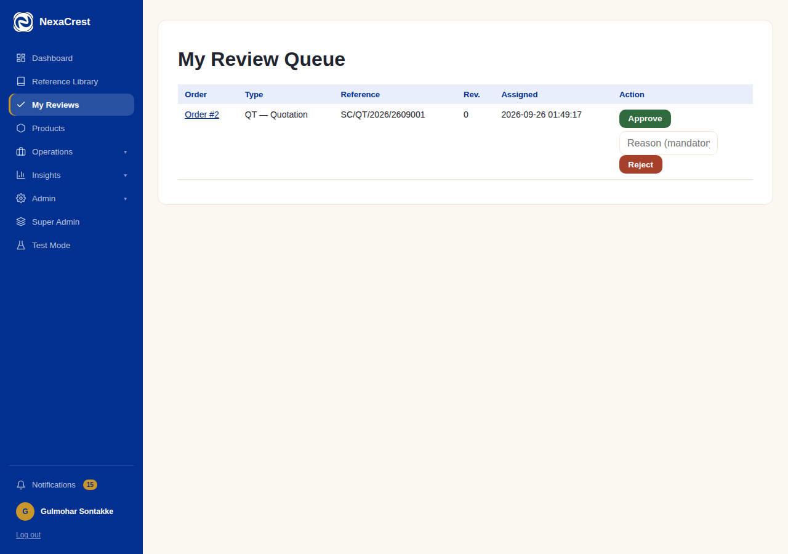
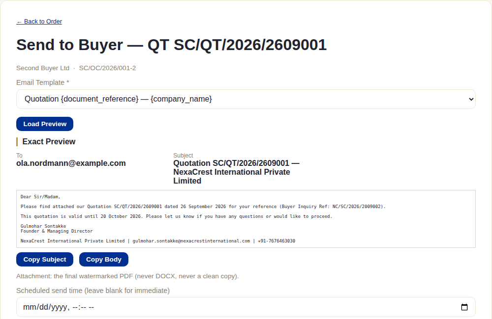
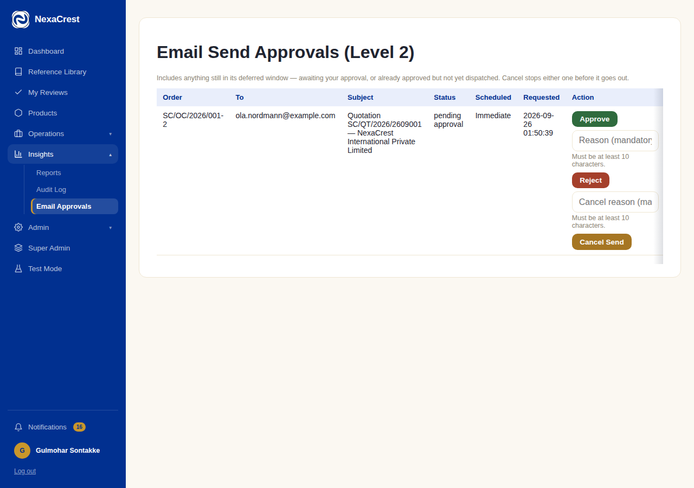

# Document Review & Approval

## What this module is for

Every generated document goes through the same lifecycle regardless of
which stage created it: **draft → in review → approved → sent**. This
chapter covers that lifecycle in full — referenced from nearly every stage
chapter earlier in this document rather than repeated in each one.

The one rule stated in the [introduction](./00-introduction.md) is worth
repeating here: **a stage gate passing and a document being approved are
two completely separate things.** A document can sit in draft for days
while the order moves several stages ahead — that's expected, not broken.

## The system does this automatically

- A document is created as a **draft** the instant it's generated — nothing
  else needs to happen first.
- The moment every assigned reviewer has approved (and none have rejected),
  the system **automatically finalizes** the document: swaps the
  draft-watermarked PDF for the final one and flips its status to
  **approved** — there's no separate "finalize" button.
- **Only an approved (or already-sent) document can ever be sent to the
  buyer** — the send screen refuses anything still in draft or review.
- **The client only ever receives the final watermarked PDF** — never the
  DOCX, never a draft-watermarked copy, regardless of what's requested.
  This is enforced structurally in the send logic itself, not just hidden
  in the UI.

## What staff do

### Generating and tracking documents

The **Documents** section on every order lists every document generated so
far with its own status, alongside the buttons to generate each type (PDF
and/or DOCX, per type):

A **draft** can be deleted (**Delete Draft**) if it was generated by
mistake — this only removes the draft; it never touches an approved or sent
document.

### Assigning reviewers

From the order page, staff assign one or more reviewers to a generated
document — this moves it from draft to **in review**. Each assigned
reviewer sees it in **My Review Queue** (`/reviews`):

**Approve** (with an optional comment) or **Reject** (a reason is
mandatory) — a reject sends the document back to **draft**, and the
original creator has to regenerate a fresh revision rather than edit the
rejected one in place.

### Sending to the buyer — a two-level approval

Once approved, **Send Document** opens a compose/preview screen showing the
**exact** merged subject and body that will be sent, with a live preview
against the real email template:

**Submit for Level-2 Approval** doesn't send anything yet — it's Level 1.
A separate approver (anyone with the `approve_email_send` permission) has
to clear it from the **Email Send Approvals** queue before it goes out:

Even after Level-2 approval, the send can still be **cancelled** right up
until it actually goes out — this whole span (submitted → approved →
dispatched) is the "deferred send" window, giving staff a chance to catch a
mistake before it reaches the buyer. Once it's actually dispatched, nothing
here can pull it back.

## What the client does (or doesn't)

Nothing in this workflow involves the buyer directly — they simply receive
the email once it clears both levels of approval and is actually sent.
There's no visibility into drafts, review status, or pending approvals from
their side; they only ever see the final result in their portal's Documents
list (see [Client Portal](./12-client-portal.md)).

## What happens next

None of this blocks the order's own stage progress — see the "one rule"
note above. What it does gate is whether a document has actually reached
the buyer in a form that reflects real, reviewed figures, which is the
entire point of keeping generation, review, and sending as three separate
steps rather than one.
