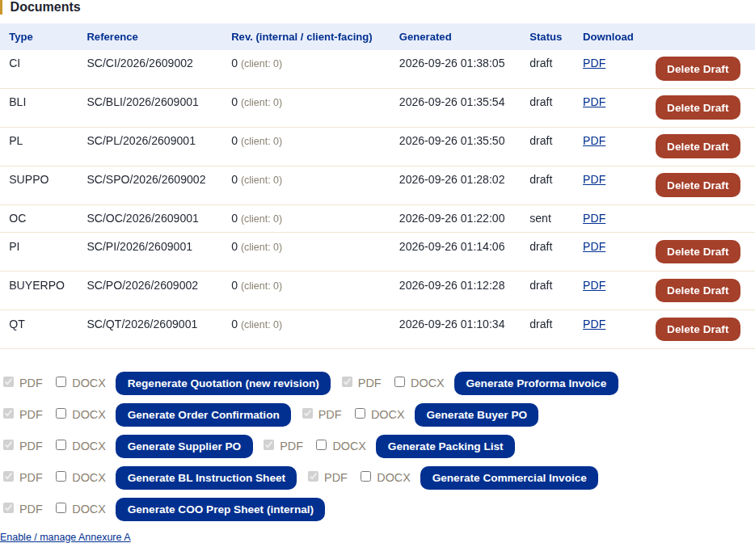
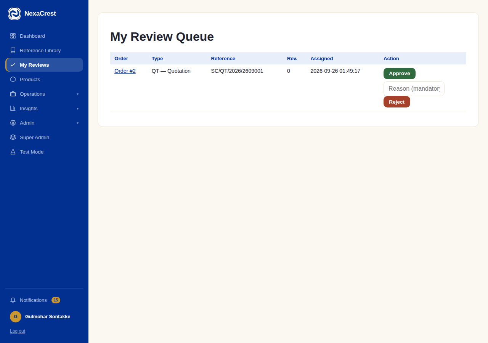
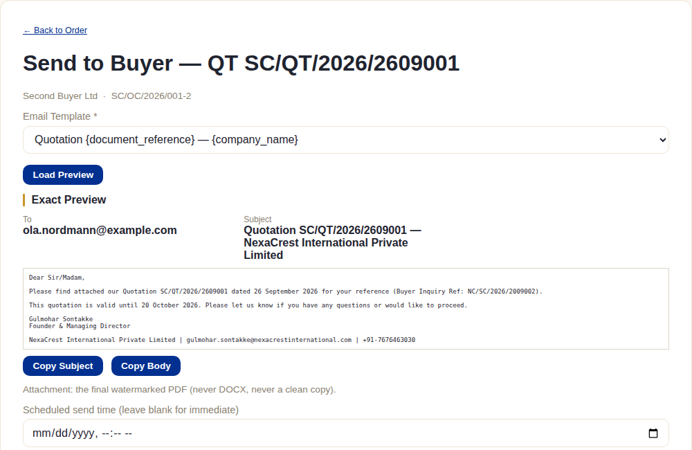
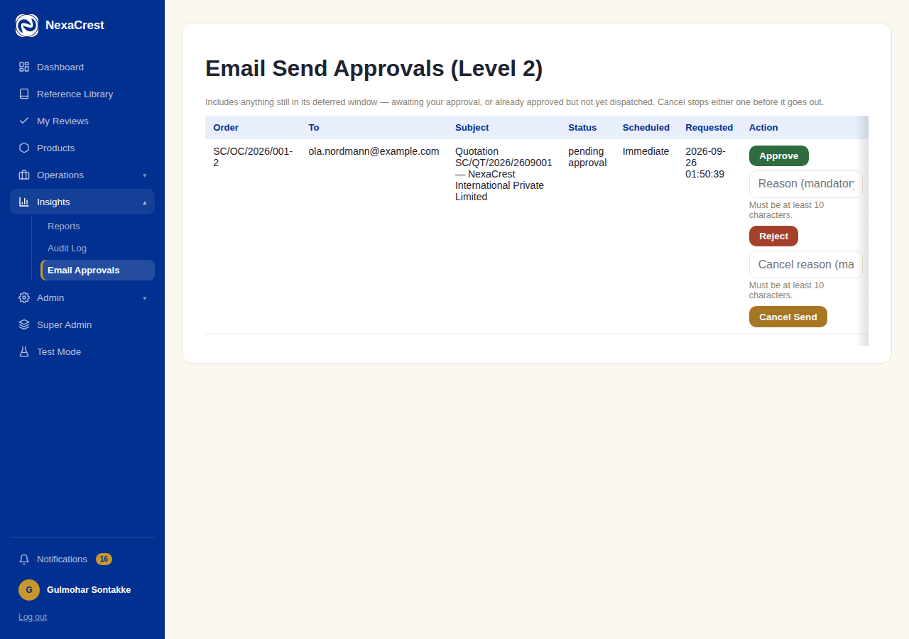

# Document Review & Approval

## What this module is for

Every generated document goes through the same lifecycle regardless of
which stage created it: **draft → in review → approved → sent** — and, if a
newer revision later gets approved, **superseded**. This chapter covers
that lifecycle in full — referenced from nearly every stage chapter earlier
in this document rather than repeated in each one.

The one rule stated in the [introduction](./00-introduction.md) is worth
repeating here: **a stage gate passing and a document being approved are
two completely separate things.** A document can sit in draft for days
while the order moves several stages ahead — that's expected, not broken.

## The system does this automatically

- A document is created as a **draft** the instant it's generated — nothing
  else needs to happen first.
- The moment every assigned reviewer has approved (and none have rejected),
  the system **automatically finalizes** the document: swaps the
  draft-watermarked PDF for the final one and flips its status to
  **approved** — there's no separate "finalize" button.
- **Only an approved (or already-sent) document can ever be sent to the
  buyer** — the send screen refuses anything still in draft or review.
- **The client only ever receives the final watermarked PDF** — never the
  DOCX, never a draft-watermarked copy, regardless of what's requested.
  This is enforced structurally in the send logic itself, not just hidden
  in the UI.
- **Only the latest revision of a document can ever be approved.** If a
  newer revision of the same document type was generated while an older
  one still had a reviewer assigned, that older review is refused outright
  — the message says a newer revision exists and points the reviewer at
  it. This closes the gap where a slow reviewer could approve a copy that
  was already out of date.
- **Approving a revision automatically invalidates every other revision of
  the same document that was still marked approved or sent.** The moment
  one revision finishes approval, any sibling revision of that same
  document type for that same order — including one already sent to the
  buyer — flips to **superseded** and is re-rendered with a bright red
  **"INVALID DOCUMENT — SUPERSEDED"** watermark in place of its old final
  one. Only one revision of a document type can ever be the valid one at a
  time; the superseded copy is never deleted (same soft-delete-only rule
  as every other generated file) but is unmistakable the moment anyone
  opens it.
- **A buyer-facing document past its first issue is stamped with its own
  revision number.** From the second time a document type is actually sent
  to a buyer onward, its watermark carries "— REVISION 02" (etc.) alongside
  the draft/final text, so a printed or forwarded copy is never ambiguous
  about which revision it is even away from the system. The very first
  issue of a document carries no revision stamp — there's nothing yet to
  distinguish it from.

## What staff do

### Generating and tracking documents

The **Documents** section on every order lists every document generated so
far with its own status, alongside the buttons to generate each type (PDF
and/or DOCX, per type):

A **draft** can be deleted (**Delete Draft**) if it was generated by
mistake — this only removes the draft; it never touches an approved or sent
document.

A document showing **INVALID — SUPERSEDED** (a red badge in this table, and
the same wording spelled out under Step 2 of that document's own review
panel below) has been automatically replaced by a newer approved revision
— it can no longer be sent, and its PDF now carries the INVALID DOCUMENT
watermark. Work from whichever revision of that type is still showing
**approved** or **sent** instead.

### Assigning reviewers

From the order page, staff assign one or more reviewers to a generated
document — this moves it from draft to **in review**. Each assigned
reviewer sees it in **My Review Queue** (`/reviews`):

**Approve** (with an optional comment) or **Reject** (a reason is
mandatory) — a reject sends the document back to **draft**, and the
original creator has to regenerate a fresh revision rather than edit the
rejected one in place.

### Sending to the buyer — a two-level approval

Once approved, **Send Document** opens a compose/preview screen. When the
document being sent has an obvious matching template (the normal case —
e.g. Order Confirmation matches the "Order Confirmation" template), that
template is pre-selected and its **exact** merged subject and body are
shown immediately, with no extra click needed:

**Submit for Level-2 Approval** doesn't send anything yet — it's Level 1.
A separate approver (anyone with the `approve_email_send` permission) has
to clear it from the **Email Send Approvals** queue before it goes out.
That queue has its own item in the sidebar (next to **My Reviews** — not
tucked under Insights), and a notification telling an approver a send is
waiting links straight there:

Even after Level-2 approval, the send can still be **cancelled** right up
until it actually goes out — this whole span (submitted → approved →
dispatched) is the "deferred send" window, giving staff a chance to catch a
mistake before it reaches the buyer. Once it's actually dispatched, nothing
here can pull it back.

### Admin-configurable: turning sending off, or skipping Level 2

Two independent switches in Company Settings, both off by default (meaning:
nothing changes from the behaviour above until an admin turns one on):

- **`mail_sending_enabled`** — a master kill switch for every non-security
  email (2FA codes and password resets are never affected). Turn it off
  while diagnosing a hosting SMTP problem, so nothing can accidentally reach
  a real buyer while credentials are being worked out.
- **`mail_approval_queue_enabled`** — on by default, preserving the two-level
  flow above exactly. Turned **off**, Level 1's submit button sends the
  email immediately instead of queuing it for a second approver — useful
  for a small team, or while testing, where waiting for a second person
  isn't practical. The email log still records the attempt either way, and
  a failed immediate attempt (e.g. SMTP still not configured) shows up as
  an error right away rather than silently sitting in the queue forever.

## What the client does (or doesn't)

Nothing in this workflow involves the buyer directly — they simply receive
the email once it clears both levels of approval and is actually sent.
There's no visibility into drafts, review status, or pending approvals from
their side; they only ever see the final result in their portal's Documents
list (see [Client Portal](./12-client-portal.md)).

## What happens next

None of this blocks the order's own stage progress — see the "one rule"
note above. What it does gate is whether a document has actually reached
the buyer in a form that reflects real, reviewed figures, which is the
entire point of keeping generation, review, and sending as three separate
steps rather than one.
