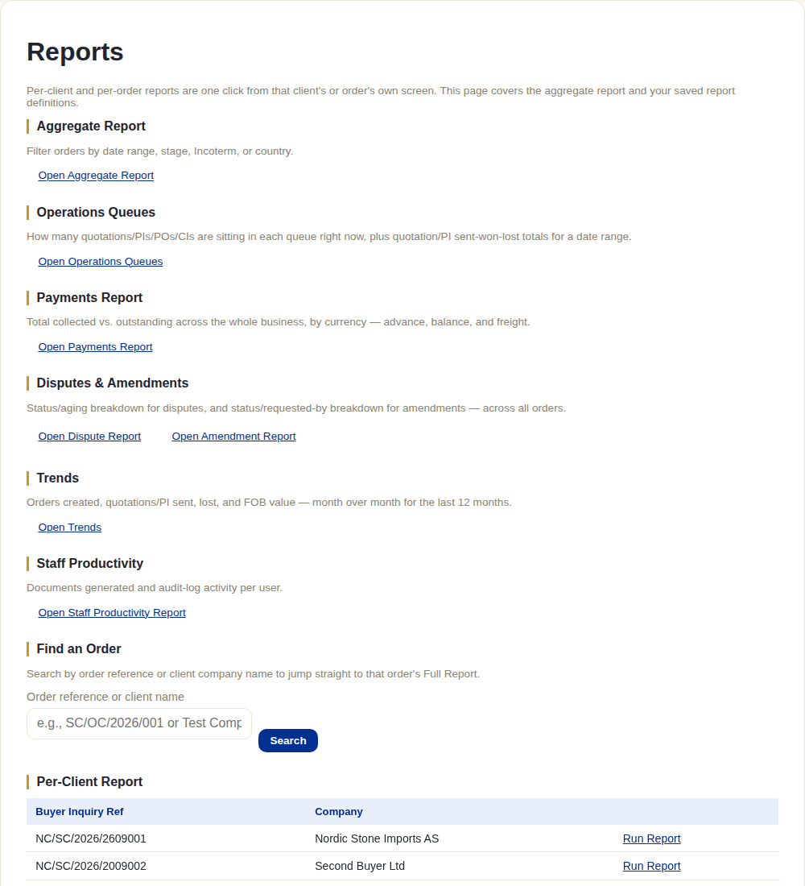
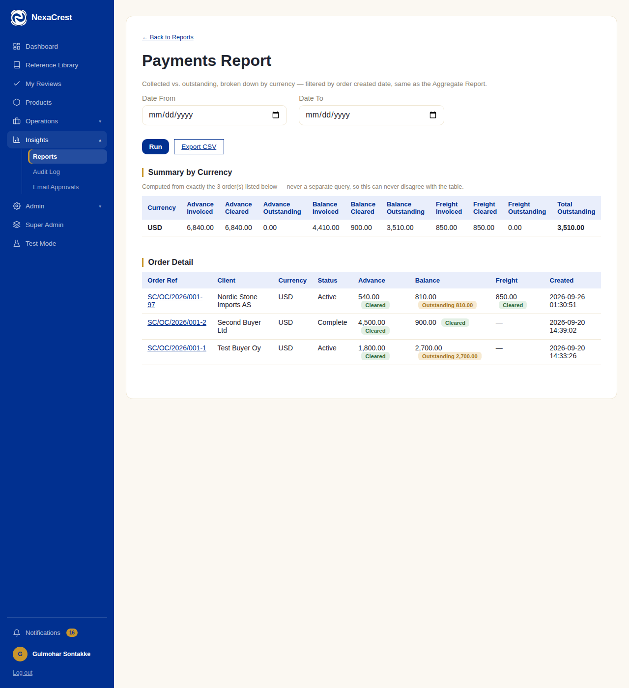

# Reports

## What this module is for

Answering business questions about the whole book of orders — money
collected vs. outstanding, what's stuck in which queue, how disputes and
amendments are trending, where the pipeline is bottlenecked — without
staff having to open every order individually.

## The system does this automatically

- Nothing progresses or changes because a report was run — every report
  here is **read-only**, purely a view over the same order/payment/document
  data covered in every earlier chapter.
- Every summary figure is **computed from the same rows the detail table
  below it shows** — never a separate query that could quietly disagree
  with the detail. The Payments Report states this explicitly on screen.

## What staff do

Everything starts from the **Reports** hub:

- **Aggregate Report** — filter orders by date range, stage, Incoterm, or
  country; the base report most others build on or reference.
- **Operations Queues** — how many quotations/PIs/POs/CIs are sitting
  unresolved right now, plus sent/won/lost totals for a date range — the
  "what needs attention today" view.
- **Payments Report** — collected vs. outstanding, broken down by currency,
  across advance/balance/freight:

  

- **Dispute Report** / **Amendment Report** — status and aging breakdowns
  across every order, not just one at a time.
- **Trends** — orders created, quotations/PI sent, lost, and FOB value,
  month over month for the last 12 months.
- **Staff Productivity** — documents generated and audit-log activity per
  user (requires the separate `view_staff_reports` permission — this one
  isn't available to every role by default, unlike the others).
- **Find an Order** — search by order reference or client name to jump
  straight to that order's own Full Report.
- **Per-Client Report** — every client listed, one click into their own
  report (also reachable from the client's own page).
- **Per-Order Report** — reachable from any order's own "Full Report" link.
- **Saved Reports** — save an Aggregate Report's filter set with a name and
  visibility (private or shared with other staff), then re-run it later
  without re-entering the filters.

Most report screens with a date range also offer **Export CSV** — a
spreadsheet-ready download of exactly what's on screen, for anything that
needs to leave the system (board reporting, external accounting, etc.).

## What the client does (or doesn't)

Nothing — Reports is an entirely internal, staff-only module. Nothing here
is visible from the client portal in any form.

## What happens next

Nothing changes as a result of viewing a report — this module exists purely
to inform decisions staff make elsewhere in the system (chasing an
outstanding payment, following up a stuck quotation, reviewing a pattern of
disputes), not to trigger anything itself.
