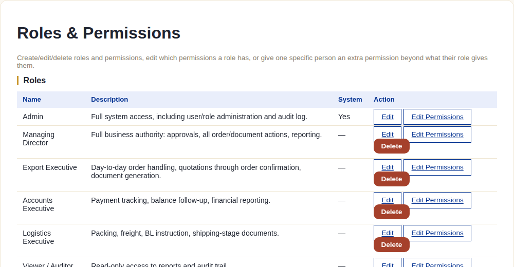
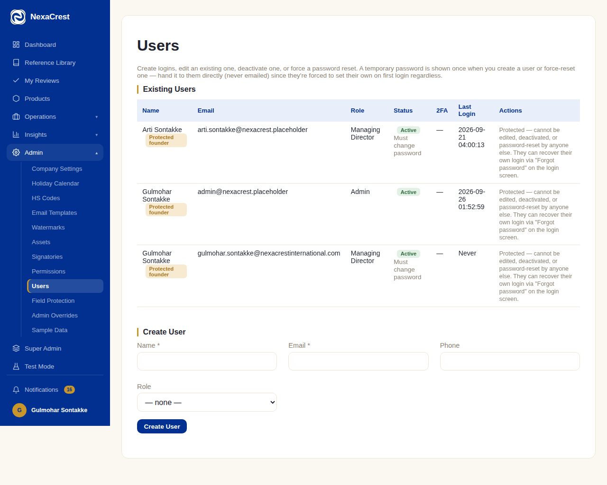

# Admin & Settings

## What this module is for

Everything that configures how the system behaves, rather than any single
order — roles and who can do what, users, company/bank details baked into
documents, the HS code master list, email templates, watermarks,
signatories, and a handful of override/protection mechanisms. Only visible
in the sidebar to staff who actually have the relevant permission — most
Admin sub-items are simply absent for a role that isn't allowed to touch
them.

## The system does this automatically

- A **Super Admin** bypasses every permission check outright — this tier
  exists specifically so there's always at least one account that can never
  be locked out of its own system by a permissions misconfiguration.
- **System roles** (marked "Yes" under System) can't be deleted — only
  edited — since core behavior depends on them existing.
- A brand-new **permission** does nothing on its own the moment it's
  created here — a developer still has to add a check for it somewhere in
  the code before it actually gates anything. Creating one is bookkeeping,
  not a live switch.

## What staff do

### Roles & Permissions

Create, edit, or delete roles; edit which permissions a role has; or grant
one specific person an extra permission beyond what their role normally
gives them (with a mandatory, logged reason):

Below the roles list (not shown here) sits the full **Role Matrix** — every
permission against every role in one table — and a **Permission
Definitions** list for creating new permission keys.

### Users

Create logins, edit an existing one, deactivate one, or force a password
reset. A temporary password is shown **once**, at creation or reset — staff
hand it to the person directly, since it's never emailed and they're forced
to set their own on first login regardless:

Notice the **"Protected — founder"** tag on certain accounts: these
specific users can't be edited, deactivated, or password-reset by anyone
else at all, even an Admin — they can only recover their own login via
"Forgot password" on the login screen themselves. This exists so the
people who set the company up can never be locked out by another admin's
mistake (or malice).

### The rest of Admin

- **Company Settings** — legal name, registered/corporate office, GSTIN/IEC,
  bank details, LUT number — the exact fields snapshotted onto every
  generated document (see the note in [Chapter 1](./01-stage1-enquiry-quotation.md)
  about data integrity).
- **Holiday Calendar** — the dates the Working Days Calculator (used for
  dispute response deadlines, see [Disputes](./11-disputes.md)) excludes.
- **HS Codes** — the master list product HS codes must come from; an order
  can never use a code that isn't on this list.
- **Email Templates** — subject/body/footer for every system email, with
  template-key placeholders merged in at send time (see
  [Document Review & Approval](./13-document-review-approval.md)).
- **Watermarks** — the draft vs. final watermark text/styling swapped
  automatically when a document is approved.
- **Assets** — logo, company seal, and signature images used across every
  document template.
- **Signatories** — which users are eligible to sign which document types,
  and their designation.
- **Field Protection** — which specific fields are locked from casual
  editing once set (e.g. the BL type field mentioned in Stage 7).
- **Admin Overrides** — a log/interface for the various "override" actions
  scattered through this system (amendment reference, locked client data,
  etc.) — every one of them requires a logged reason, never a silent edit.
- **Sample Data** — populate or clear sample/demo data; see
  [Test Mode](./16-test-mode.md) for the safer, sandboxed version of this.

## What the client does (or doesn't)

Nothing — Admin & Settings is entirely internal, with no client-facing
surface of any kind.

## What happens next

Nothing changes anywhere else automatically — every setting here takes
effect the next time the relevant action happens (the next document
generated picks up the current company settings/watermark, the next login
attempt respects the current role permissions, and so on), never
retroactively.
