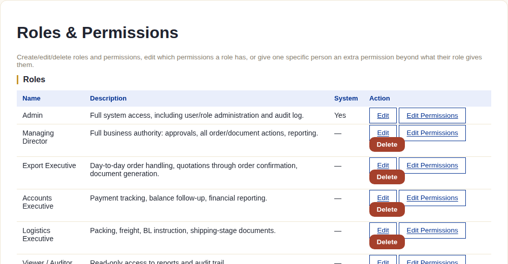
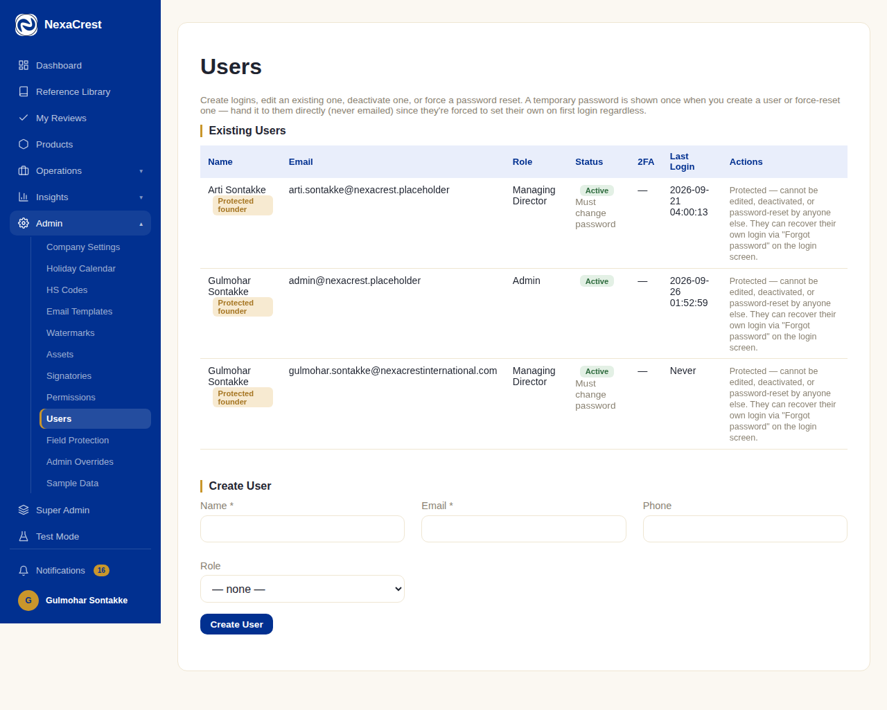

# Admin & Settings

## What this module is for

Everything that configures how the system behaves, rather than any single
order — roles and who can do what, users, company/bank details baked into
documents, the HS code master list, email templates, watermarks,
signatories, and a handful of override/protection mechanisms. Only visible
in the sidebar to staff who actually have the relevant permission — most
Admin sub-items are simply absent for a role that isn't allowed to touch
them.

## The system does this automatically

- A **Super Admin** bypasses every permission check outright — this tier
  exists specifically so there's always at least one account that can never
  be locked out of its own system by a permissions misconfiguration.
- **System roles** (marked "Yes" under System) can't be deleted — only
  edited — since core behavior depends on them existing.
- A brand-new **permission** does nothing on its own the moment it's
  created here — a developer still has to add a check for it somewhere in
  the code before it actually gates anything. Creating one is bookkeeping,
  not a live switch.

## What staff do

### Roles & Permissions

Create, edit, or delete roles; edit which permissions a role has; or grant
one specific person an extra permission beyond what their role normally
gives them (with a mandatory, logged reason):

Below the roles list (not shown here) sits the full **Role Matrix** — every
permission against every role in one table — and a **Permission
Definitions** list for creating new permission keys.

`manage_orders` has always been the single gate for both *seeing* and
*editing* the Orders and Clients modules — there was no way to let
someone look without also being able to touch anything. Two narrower
permissions, **View Orders (read-only)** (`view_orders`) and **View
Clients (read-only)** (`view_clients`), now admit a read-only visitor to
the Orders list/detail page and the Clients list/detail page
respectively, alongside `manage_orders` — never instead of it, and never
touching any mutating route or button, which all stay gated on
`manage_orders` (or its existing finer siblings like `manage_payments`,
`manage_shipping`, `close_orders`). The seeded **Viewer / Auditor** role
carries both, so it can finally see real order and client data instead
of only reports and the audit log.

### Users

Create logins, edit an existing one, deactivate one, or force a password
reset. A temporary password is shown **once**, at creation or reset — staff
hand it to the person directly, since it's never emailed and they're forced
to set their own on first login regardless:

Notice the **"Protected — founder"** tag on certain accounts: these
specific users can't be edited, deactivated, or password-reset by anyone
else at all, even an Admin — they can only recover their own login via
"Forgot password" on the login screen themselves. This exists so the
people who set the company up can never be locked out by another admin's
mistake (or malice).

### The rest of Admin

- **Company Settings** — legal name, registered/corporate office, GSTIN/IEC,
  bank details, LUT number — the exact fields snapshotted onto every
  generated document (see the note in [Chapter 1](./01-stage1-enquiry-quotation.md)
  about data integrity). The same screen's **Mail Redirect** section holds
  four settings, independent of [Test Mode](./16-test-mode.md)'s own email
  redirect: a **Redirect all mail** toggle plus address — when on, every
  non-security outbound email (order updates, document sends, and so on)
  goes to that one address instead of its real recipient, useful for
  rehearsing real mail without touching Test Mode at all — and a **CC
  emails** list (comma-separated) plus a single **Default CC email**,
  both applied to every non-security outbound email regardless of whether
  redirect is on. Staff 2FA codes and password-reset links are never
  redirected or CC'd, the same carve-out Test Mode uses, so a lockout can
  never happen because of either switch. The CC list and default CC are
  marked **Super Admin only** right on the screen — anyone else sees them
  read-only, with no unlock option, since a standing CC address silently
  sees every client email that goes out. Below the main form, two **Send
  Test Email** buttons — one for the SMTP server configured in `.env`,
  one for Zoho Mail if it's enabled — send one real email straight through
  that transport only, bypassing Test Mode, Mail Redirect, and each
  other's fallback, so a connection/credential problem shows up as an
  actual error on screen instead of a silent log line.
- **Holiday Calendar** — the dates the Working Days Calculator (used for
  dispute response deadlines, see [Disputes](./11-disputes.md)) excludes.
- **HS Codes** — the master list product HS codes must come from; an order
  can never use a code that isn't on this list. Every code is **6 or 8
  plain digits, never dotted** (e.g. `68022310`, not `6802.23`) — this is
  enforced on both manual add and bulk import, so a customs reference that
  still uses the dotted convention needs its dots stripped before typing
  or pasting it in. A real customs reference sheet can be onboarded in one
  pass via Bulk Import (paste straight from Excel — Tab-separated, or
  comma-separated for hand-typed lines) rather than adding codes one at a
  time, and each code can carry its own short usage note. The Product
  Guide underneath it is a separate, read-only "which code do I actually
  use for this product" reference (also bulk importable) — most useful
  for a fresher who has never had to classify a product before.
- **Email Templates** — subject/body/footer for every system email, with
  template-key placeholders merged in at send time (see
  [Document Review & Approval](./13-document-review-approval.md)).
- **Watermarks** — the draft vs. final watermark text/styling swapped
  automatically when a document is approved. Each of the two (draft/final)
  independently supports Text only, Image only, or Text and image
  together — "Both" really does render both layers, they're independent
  overlays, not either/or. The watermark image itself comes from Company
  Assets (upload it there first). If the active watermark image's file
  ever goes missing from server storage (moved, deleted, or not carried
  over by a deploy), the Watermarks screen shows a clear warning instead
  of a silently incomplete PDF, and saving Image/Both mode is refused
  until a fresh image is re-uploaded — this replaced an earlier gap where
  such a save could succeed and every subsequent PDF would quietly show
  the text watermark only, with nothing indicating why.
- **Logistics Partners** — the CHA (Customs House Agent) and transportation
  contact directory, gated by its own `manage_logistics_partners`
  permission (same tier as HS Codes: Admin/MD/ED and Super Admin by
  default). Each partner carries a **Service Type** — CHA only,
  Transportation only, or **CHA + Transportation** — since the same
  company sometimes handles both and sometimes only one; a "both" partner
  shows up whichever way staff filter the list. Alongside name/address/
  city/state, every entry can carry a WhatsApp number and phone for both
  the company and a named contact person, plus GSTIN and PAN for the
  paperwork side. This directory is standalone for now — a quick
  "who do we call for this" lookup — not yet wired into a specific order
  or Order Cost Entry.
- **Payment Presets** (`/payment-presets`) — full CRUD for the advance/
  balance split every order picks up, gated by its own
  `manage_payment_presets` permission (same tier as Logistics Partners:
  Admin/MD/ED and Super Admin by default). Each preset carries **Advance
  %** and **Balance %** (must add to 100), the **Advance Trigger Text**
  (the second half of the printed advance sentence), a **Balance Trigger
  Option** (Before Shipment vs. Against Scanned BL Copy), **Balance
  Days**, a **Currency**, a **Default** flag (exactly one preset may be
  default — saving one as default silently clears the flag on every
  other preset), and whether it **Requires MD Approval**. Creating a new
  preset — say a 20% advance / 80% balance trial-order preset — needs no
  further code change anywhere: every order on that preset calculates
  its advance/balance amounts and prints the right percentages
  automatically, since the figures are computed purely from whatever
  `advance_pct`/`balance_pct` the assigned preset carries, never a
  hardcoded 40/60 split.
  Balance Trigger Wording is a free-text field holding the exact sentence
  printed on the Quotation, Proforma Invoice, and Buyer PO (the only
  three documents whose balance clause varies by preset — the Commercial
  Invoice's own Section 7 balance clause is fixed at a company-wide
  "Calendar Days after NexaCrest emails the scanned BL copy" wording
  regardless of preset, driven by Company Settings' own
  `ci_balance_days_post_bl` value instead). It must contain the literal
  token `{days}`, substituted with that preset's own Balance Days value
  at render time; leaving it blank falls back to one of two built-in
  sentences depending on the Balance Trigger Option, so an admin never
  needs to backfill older preset rows. Both seeded presets ship
  **protected** — unlock via **Field Protection** before editing or
  deactivating, same as a protected Company Setting or T&C clause — since
  they drive where money is actually sent and received. A preset is never
  hard-deleted: orders reference it by ID, so even a deactivated preset
  stays readable on every document already generated against it.
- **Legal Terms & Definitions** — on every buyer-facing document except
  the BL Instruction Sheet, a final numbered section ("N. LEGAL TERMS &
  DEFINITIONS") prints a red **Legal Terms** box and a blue
  **Definitions** box, each a plain list of admin-editable clauses — same
  table, same edit screen, and the same `tc_clauses` rows as the
  ordinary numbered Terms & Conditions list already uses, just tagged
  with `clause_group` set to `legal_terms` or `definitions` instead of
  the default `standard`. There is no separate admin screen for these:
  editing one is an ordinary clause edit, exactly as described for the
  regular T&C list. One further per-clause setting, **visibility_rule**,
  can scope a Legal Terms clause to only the orders on a matching
  **Balance Trigger Option** — used for a Bill of Lading Policy clause
  that only makes sense on a "balance against scanned BL copy" preset,
  so it never shows on an order using a "before shipment" preset instead
  (and vice versa). Leaving visibility_rule on its default ("always")
  shows the clause on every order regardless of preset, same as every
  ordinary T&C clause already does.
- **Compliance Task Types** (`/compliance-task-types`) — the admin-editable
  list of names (ECGC Cover, Pre-Shipment Inspection, Fumigation
  Certificate, Phytosanitary Certificate, Due Diligence by default) that
  appears as a checklist on every order's own page — see
  [Stage 9 — Document Despatch & Closure](./09-stage9-despatch-closure.md)
  for the checklist itself. Gated by `manage_compliance_task_types`, same
  tier as HS Codes/Logistics Partners (Admin/MD/ED and Super Admin by
  default). This screen only edits the list of names; it does not itself
  grant access to the checklist on an order's page — that uses the
  existing `close_orders` permission, "the person who has permission to
  close the order must able to see this otherwise no meaning for this."
  Deactivating a type removes it from every order's checklist going
  forward without touching any status already recorded against it;
  deleting one outright only works if no order has ever recorded a status
  against it, otherwise the screen asks you to deactivate instead.
- **Reference Library** (`/reference-docs`) — any authenticated staff
  member can view and download every entry here by default; adding,
  deleting, or re-uploading a file requires `manage_company_settings`,
  the same gate as Company Settings itself. Alongside the system's own
  fixed reference documents (SOPs, the Stage Gate Reference, the
  Cross-Verification Checklist), this is where documents a client might
  ask to see to verify the business live — the Factory SOP, Quarry SOP,
  Factory Processing Agreement template, and Quarry Block Supply
  Agreement template are the first four seeded here, each downloadable
  straight from the list. A custom entry can optionally be filed under a
  **Category** (**Manage Categories**, from the Reference Library page):
  uncategorized stays visible to everyone (the default, unchanged
  behaviour), but a category can carry a **Required Permission** — only
  staff holding that permission then see documents filed under it, e.g. a
  CA/Accounts-only working-papers folder restricted to `ca_module_view`.
  Deleting a category never deletes its documents — they fall back to
  uncategorized (visible to everyone again). The fixed 8 system reference
  documents are never scoped this way.
- **Assets** — logo, company seal, and signature images used across every
  document template.
- **Signatories** — which users are eligible to sign which document types,
  and their designation.
- **Field Protection** — which specific fields are locked from casual
  editing once set (e.g. the BL type field mentioned in Stage 7).
- **Admin Overrides** — a log/interface for the various "override" actions
  scattered through this system (amendment reference, locked client data,
  etc.) — every one of them requires a logged reason, never a silent edit.
- **Sample Data** — populate or clear sample/demo data; see
  [Test Mode](./16-test-mode.md) for the safer, sandboxed version of this.

## What the client does (or doesn't)

Nothing — Admin & Settings is entirely internal, with no client-facing
surface of any kind.

## What happens next

Nothing changes anywhere else automatically — every setting here takes
effect the next time the relevant action happens (the next document
generated picks up the current company settings/watermark, the next login
attempt respects the current role permissions, and so on), never
retroactively.
