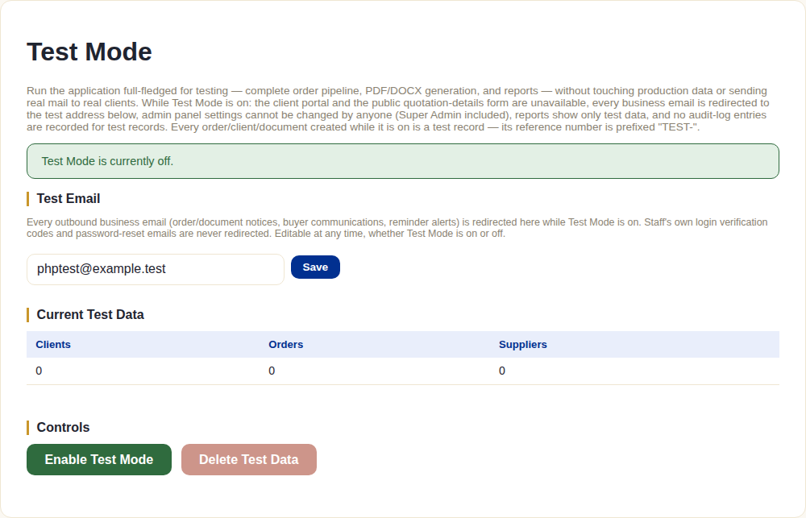

# Test Mode

## What this module is for

Rehearsing the entire system — full order pipeline, real PDF/DOCX
generation, real reports — without touching production data or sending a
single real email to a real buyer. This is the sanctioned way to train
someone new, test a change, or demo the system, instead of creating
throwaway "test" clients that pollute real reports and risk an accidental
email to an actual buyer.

## The system does this automatically, once switched on

- **The client portal and the public quotation-details form both become
  unavailable** — since there's no safe way to let an outside party into a
  system that's mid-rehearsal.
- **Every outbound business email redirects** to a single configured test
  address, regardless of who the real recipient would have been. The one
  exception: staff's own login verification codes and password resets are
  never redirected — those still need to reach the actual staff member.
- **Every order/client/document created is automatically flagged as a test
  record**, with its reference number prefixed `TEST-` — nothing created
  while Test Mode is on can be mistaken for a real one later.
- **Reports show only test data** while Test Mode is on — none of the
  rehearsal activity leaks into real business reporting.
- **No audit-log entries are recorded** for test records — rehearsal
  actions don't clutter the real audit trail.
- **Admin panel settings become frozen** — nobody, including a Super Admin,
  can change company settings, permissions, or any other admin
  configuration while Test Mode is active. This prevents a rehearsal
  session from accidentally reconfiguring the live system.

## What staff do

From the **Test Mode** screen:

1. Set the **Test Email** address once (editable any time, on or off) —
   every redirected email lands here instead of a real inbox.
2. **Enable Test Mode** — a confirmation dialog spells out exactly what
   changes (portal/public form unavailable, mail redirected) before it
   takes effect.
3. Work normally — create clients, orders, generate every document type,
   run every report — everything behaves identically to production, just
   contained and clearly labeled.
4. **Delete Test Data** once done — this permanently removes every test
   client/order/document and their generated files. **Disable Test Mode**
   is deliberately blocked while any test data still exists, forcing
   cleanup before returning to normal operation rather than leaving
   abandoned test records around indefinitely.

## What the client does (or doesn't)

Nothing — literally cannot, since the client portal and public intake form
are both switched off for the duration. There is no client-facing surface
to Test Mode at all.

## What happens next

Once Test Mode is disabled (after test data cleanup), the system returns
exactly to normal operation — nothing about production data, settings, or
behavior is altered by having rehearsed in Test Mode.
